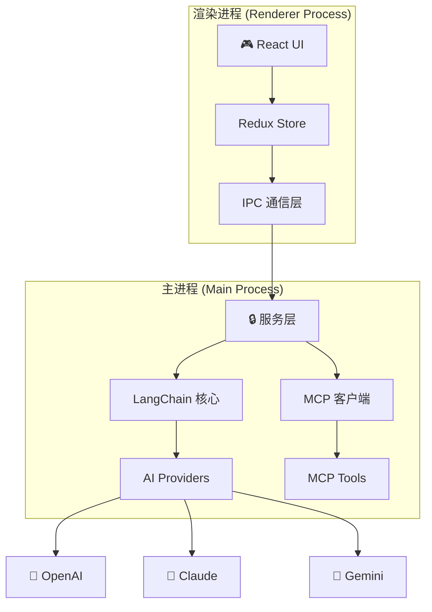

<div align="center">
  
  
  # PromptX Desktop Client
  
  ### 🚀 让 AI 触手可及 - 企业级 AI 桌面客户端
  
  [](https://github.com/promptx/desktop-client/releases)
  [](LICENSE)
  [](https://github.com/promptx/desktop-client/releases)
  [](https://langchain.com)
  
  [English](README_EN.md) | 简体中文
</div>

---

## 🎯 产品介绍

**PromptX Desktop Client** 是 [PromptX](https://github.com/deepractice/PromptX) 生态的旗舰桌面应用，为用户提供企业级的 AI 对话体验。通过整合多个主流 AI 提供商和强大的 MCP 插件生态，让 AI 能力真正触手可及。

### ✨ 核心特性

- 🤖 **多模型支持** - 一键切换 OpenAI、Claude、Gemini 等主流 AI 模型
- 🔌 **MCP 插件生态** - 通过插件扩展 AI 能力，连接真实世界的工具和服务
- 💬 **流畅对话体验** - 支持流式响应、Markdown 渲染、代码高亮
- 🎨 **专业界面设计** - 基于 Ant Design 的现代化 UI，支持亮/暗主题
- 🔒 **企业级安全** - API 密钥加密存储，主进程隔离架构
- 📦 **跨平台支持** - 支持 macOS、Windows、Linux 三大平台

## 🖼️ 界面截图

<div align="center">
  
  <p><em>主界面 - 清晰简洁的对话体验</em></p>
</div>

<details>
<summary>查看更多截图 👇</summary>

<div align="center">
  
  <p><em>模型管理 - 灵活配置多个 AI 模型</em></p>
  
  
  <p><em>MCP 插件管理 - 扩展 AI 能力边界</em></p>
</div>

</details>

## 🚀 快速开始

### 安装下载

#### 方式一：直接下载安装包

| 平台 | 下载链接 | 系统要求 |
|---------|----------|------------|
| macOS | [PromptX-Desktop-1.0.0.dmg](https://github.com/promptx/desktop-client/releases) | macOS 10.15+ |
| Windows | [PromptX-Desktop-1.0.0.exe](https://github.com/promptx/desktop-client/releases) | Windows 10+ |
| Linux | [PromptX-Desktop-1.0.0.AppImage](https://github.com/promptx/desktop-client/releases) | Ubuntu 20.04+ |

#### 方式二：从源码构建

```bash
# 克隆项目
git clone https://github.com/promptx/desktop-client.git
cd desktop-client

# 安装依赖
npm install

# 构建应用
npm run build:all

# 安装包将生成在 release 目录
```

### 初次使用

1. **启动应用** - 双击安装后的应用图标

2. **配置 AI 模型** - 点击侧边栏“模型管理”，添加您的 API 密钥
   - OpenAI: 需要 [OpenAI API Key](https://platform.openai.com/api-keys)
   - Claude: 需要 [Anthropic API Key](https://console.anthropic.com/)
   - Gemini: 需要 [Google AI API Key](https://makersuite.google.com/app/apikey)

3. **开始对话** - 选择模型，输入消息，开启 AI 之旅

4. **安装插件**（可选） - 在“插件市场”中浏览并安装 MCP 插件

## 🏭 技术架构

### 核心技术栈

| 技术层 | 技术选型 | 说明 |
|---------|----------|------|
| **前端框架** | React 18 + TypeScript 5 | 现代化前端开发体验 |
| **UI 组件库** | Ant Design 5 | 企业级 UI 组件库 |
| **桌面框架** | Electron 28 | 跨平台桌面应用解决方案 |
| **状态管理** | Redux Toolkit | 可预测的状态管理 |
| **构建工具** | Vite 5 | 极速的开发体验 |
| **AI 集成** | LangChain | 统一的 LLM 接口层 |
| **协议支持** | MCP (Model Context Protocol) | AI 工具生态集成 |

### 架构设计



## 项目结构

```
src/
├── main/                 # Electron主进程
│   ├── index.ts         # 主进程入口
│   └── services/        # 后端服务层
├── preload/             # 预加载脚本
├── renderer/            # React渲染进程
│   ├── src/
│   │   ├── components/  # UI组件
│   │   ├── store/       # Redux状态管理
│   │   └── types/       # 类型定义
└── shared/              # 共享代码
    └── types/           # 共享类型定义
```

## 开发指南

### 环境要求

- Node.js >= 18
- npm >= 8

### 安装依赖

```bash
npm install
```

### 开发模式

```bash
npm run dev
```

这会同时启动Vite开发服务器和Electron应用。

### 构建应用

```bash
# 构建渲染进程和主进程
npm run build

# 构建完整应用包
npm run build:all
```

### 代码规范

```bash
# 检查代码规范
npm run lint

# 自动修复代码规范问题
npm run lint:fix

# TypeScript类型检查
npm run type-check
```

## 📦 功能特性

### ✅ 已实现功能 (v1.0.0)

#### 💬 对话系统
- [x] 流式对话响应，实时打字机效果
- [x] Markdown 渲染支持，代码高亮显示
- [x] 多会话管理，自动保存历史记录
- [x] 消息复制、编辑、删除功能

#### 🤖 AI 模型管理
- [x] 多模型同时配置管理
- [x] OpenAI (GPT-4/GPT-3.5) 完整支持
- [x] Claude (Claude 3) 完整支持
- [x] Google Gemini 完整支持
- [x] 动态获取最新模型列表
- [x] 模型状态实时检测

#### 🔌 MCP 插件生态
- [x] 完整 MCP 协议实现
- [x] 内置 PromptX 插件集成
- [x] 插件市场界面
- [x] 工具调用可视化
- [x] 插件配置管理

#### 🎨 用户体验
- [x] 专业的 Ant Design UI
- [x] 响应式布局设计
- [x] 丰富的加载动画
- [x] 完善的错误提示
- [x] 键盘快捷键支持

### 🚀 计划功能 (v2.0)

#### 近期计划
- [ ] 本地模型支持 (Ollama)
- [ ] PromptX 角色系统深度集成
- [ ] 对话导出功能 (Markdown/PDF)
- [ ] 高级搜索和过滤
- [ ] 多语言支持

#### 中期规划
- [ ] 云同步功能
- [ ] 团队协作模式
- [ ] 插件开发 SDK
- [ ] 自定义主题系统
- [ ] AI 工作流编排

## 配置说明

应用配置存储在用户数据目录的 `config.json` 文件中：

- **Windows**: `%APPDATA%/promptx-desktop-client/config.json`
- **macOS**: `~/Library/Application Support/promptx-desktop-client/config.json`
- **Linux**: `~/.config/promptx-desktop-client/config.json`

## 开发注意事项

1. **安全性**: 所有API调用都在主进程中进行，确保API密钥安全
2. **类型安全**: 使用TypeScript严格模式，确保类型安全
3. **错误处理**: 完善的错误处理和用户反馈
4. **性能**: 使用React.memo和useMemo优化性能

## 贡献指南

1. Fork 项目
2. 创建功能分支 (`git checkout -b feature/AmazingFeature`)
3. 提交更改 (`git commit -m 'Add some AmazingFeature'`)
4. 推送到分支 (`git push origin feature/AmazingFeature`)
5. 打开 Pull Request

## 许可证

MIT License
