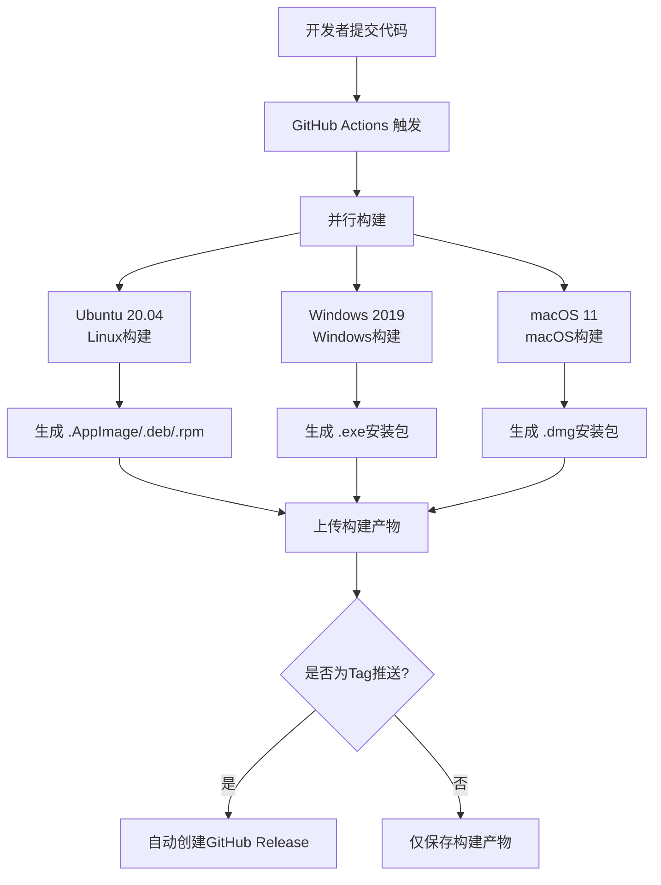

# 🚀 DeeChat CI/CD 跨平台构建指南

## 🎯 构建方案概述

使用 **GitHub Actions** 在云端同时构建 Windows、macOS、Linux 三个平台的安装包，实现**一次提交，三平台发布**。

## 🏗️ 架构设计



## 🔄 工作流程详解

### 1. **触发条件**
```yaml
on:
  push:
    branches: [ main, develop ]    # 推送到主分支
    tags: [ 'v*' ]                # 版本标签推送
  pull_request:
    branches: [ main ]             # 向主分支提PR
```

### 2. **并行构建矩阵**
```yaml
strategy:
  matrix:
    os: [ubuntu-20.04, windows-2019, macos-11]
```

**3台虚拟机同时工作：**
- 🐧 **Ubuntu 20.04**: 构建Linux版本
- 🪟 **Windows 2019**: 构建Windows版本
- 🍎 **macOS 11**: 构建macOS版本

### 3. **关键构建步骤**

#### Step 1: 环境准备
```bash
# 所有平台统一使用 Node.js 20.19.5
node --version  # v20.19.5
npm --version   # 10.8.2
```

#### Step 2: 平台特定准备
```bash
# Windows: 配置MSBuild
MSBuild.exe --version

# macOS: 配置代码签名证书
security import certificate.p12

# Linux: 安装系统依赖
sudo apt-get install libnss3-dev libatk-bridge2.0-dev
```

#### Step 3: 原生模块编译
```bash
# 每个平台重新编译better-sqlite3
npm ci
npx @electron/rebuild

# 验证编译结果
node -e "require('better-sqlite3')"
```

#### Step 4: 应用构建
```bash
# TypeScript编译
npm run build

# 平台特定打包
npm run dist:win    # Windows
npm run dist:mac    # macOS
npm run dist:linux  # Linux
```

## 📦 构建产物

### 输出文件格式

| 平台 | 文件格式 | 文件名示例 |
|------|----------|------------|
| **Windows** | `.exe` | `DeeChat-Setup-1.0.0.exe` |
| **macOS** | `.dmg` | `DeeChat-1.0.0.dmg` |
| **Linux** | `.AppImage` | `DeeChat-1.0.0.AppImage` |
| **Linux** | `.deb` | `deechat_1.0.0_amd64.deb` |
| **Linux** | `.rpm` | `deechat-1.0.0.x86_64.rpm` |

### 产物存储
```
构建产物保存30天
├── deechat-win32-x64/
│   └── DeeChat-Setup-1.0.0.exe
├── deechat-darwin-x64/
│   └── DeeChat-1.0.0.dmg
└── deechat-linux-x64/
    ├── DeeChat-1.0.0.AppImage
    ├── deechat_1.0.0_amd64.deb
    └── deechat-1.0.0.x86_64.rpm
```

## 🔐 代码签名与公证

### Windows 代码签名
```yaml
env:
  CSC_LINK: ${{ secrets.WIN_CSC_LINK }}           # Windows证书
  CSC_KEY_PASSWORD: ${{ secrets.WIN_CSC_KEY_PASSWORD }}
```

### macOS 代码签名 + 公证
```yaml
env:
  CSC_IDENTITY_AUTO_DISCOVERY: true               # 自动发现证书
  APPLE_ID: ${{ secrets.APPLE_ID }}              # Apple ID
  APPLE_ID_PASSWORD: ${{ secrets.APPLE_ID_PASSWORD }}  # App专用密码
  APPLE_TEAM_ID: ${{ secrets.APPLE_TEAM_ID }}    # 开发者团队ID
```

## 🚀 自动发布流程

### Tag推送自动发布
```bash
# 开发者创建版本标签
git tag v1.0.0
git push origin v1.0.0

# 自动触发构建+发布
# 15-30分钟后，GitHub Release页面出现：
# ✅ DeeChat-Setup-1.0.0.exe      (Windows安装包)
# ✅ DeeChat-1.0.0.dmg            (macOS安装包)
# ✅ DeeChat-1.0.0.AppImage       (Linux便携版)
# ✅ deechat_1.0.0_amd64.deb      (Ubuntu/Debian)
# ✅ deechat-1.0.0.x86_64.rpm     (CentOS/Fedora)
```

## ⏱️ 构建时间对比

| 阶段 | Windows | macOS | Linux |
|------|---------|-------|-------|
| **环境准备** | ~2分钟 | ~1分钟 | ~1分钟 |
| **依赖安装** | ~3分钟 | ~2分钟 | ~2分钟 |
| **原生模块编译** | ~5分钟 | ~3分钟 | ~3分钟 |
| **应用构建** | ~3分钟 | ~4分钟 | ~2分钟 |
| **打包签名** | ~2分钟 | ~5分钟 | ~1分钟 |
| **总计** | ~15分钟 | ~15分钟 | ~9分钟 |

> macOS构建时间较长主要因为代码签名和公证流程

## 🎮 使用方法

### 开发者工作流程
```bash
# 1. 日常开发提交
git add .
git commit -m "feat: 新增聊天功能"
git push origin develop
# → 触发构建，生成开发版本

# 2. 发布新版本
git tag v1.2.0
git push origin v1.2.0
# → 触发构建+发布，用户可下载

# 3. 查看构建状态
# 访问：https://github.com/用户名/DeeChat/actions
```

### 用户下载体验
```bash
# 用户访问Release页面选择对应平台：
# https://github.com/用户名/DeeChat/releases

Windows用户: 下载 .exe → 双击安装
macOS用户:   下载 .dmg → 拖拽到Applications
Linux用户:   下载 .AppImage → chmod +x && ./DeeChat.AppImage
```

## 🔧 配置要求

### GitHub Secrets配置
```bash
# Windows代码签名（可选）
WIN_CSC_LINK=<Windows证书Base64>
WIN_CSC_KEY_PASSWORD=<证书密码>

# macOS代码签名（可选）
APPLE_CERTIFICATE=<Apple证书Base64>
APPLE_CERTIFICATE_PASSWORD=<证书密码>
APPLE_ID=<your-apple-id@icloud.com>
APPLE_ID_PASSWORD=<App专用密码>
APPLE_TEAM_ID=<10位开发者团队ID>
```

### 依赖要求
```json
{
  "devDependencies": {
    "electron-builder": "^26.0.12",
    "@electron/rebuild": "^4.0.1"
  }
}
```

## 📊 成本分析

### GitHub Actions 免费额度
- **公开仓库**: 无限制使用 ✅
- **私有仓库**: 每月2000分钟免费
- **单次构建消耗**: ~40分钟（3平台并行）
- **每月可构建**: ~50次版本发布

### 云端优势
- ✅ **无需本地环境**: 开发者无需配置3个平台
- ✅ **并行构建**: 15分钟完成所有平台
- ✅ **自动化**: 一次配置，永久使用
- ✅ **一致性**: 所有构建环境完全相同

## 🔄 与本地构建对比

| 方案 | 时间成本 | 维护成本 | 一致性 |
|------|----------|----------|--------|
| **本地构建** | 需要3台电脑<br/>各45分钟 | 高<br/>需维护3套环境 | 低<br/>环境可能不同 |
| **CI/CD构建** | 云端15分钟<br/>并行完成 | 低<br/>一次配置即可 | 高<br/>环境完全一致 |

## 🎉 总结

**CI/CD跨平台构建**实现了：

1. 🚀 **一次提交，三平台发布**
2. ⚡ **15分钟内完成所有平台构建**
3. 🔄 **自动化发布流程**
4. 🎯 **版本标签自动触发**
5. 📦 **标准化安装包格式**

这就是现代Electron应用的**专业发布流程**！🌟