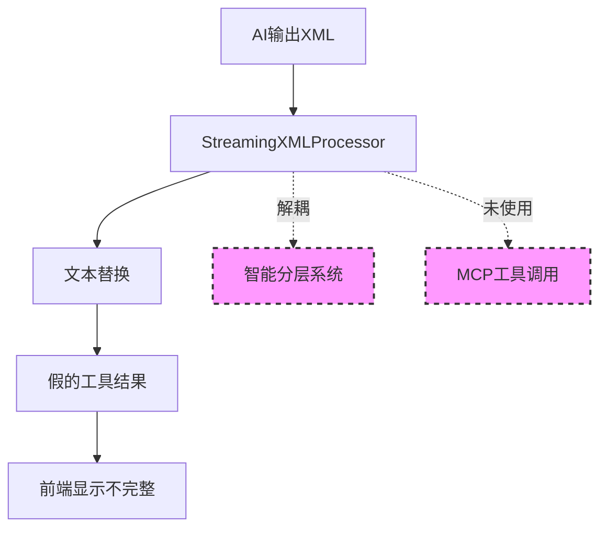
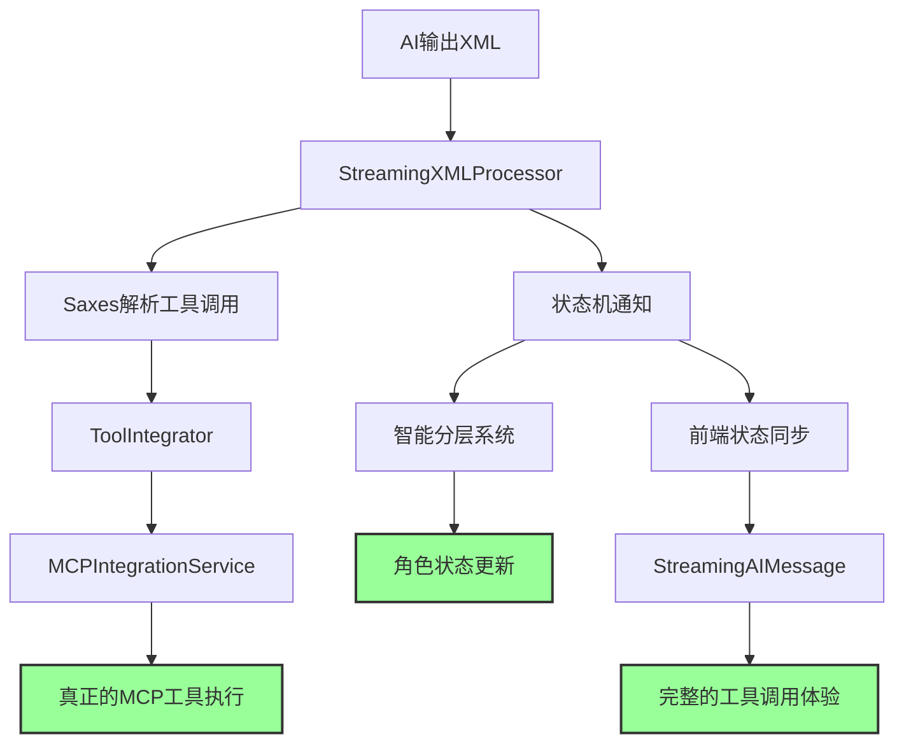

# DeeChat流式工具调用架构设计

> **版本**: v1.0  
> **日期**: 2025-08-22  
> **状态**: 设计阶段  

## 📋 架构概述

DeeChat流式工具调用架构是一个集成了智能分层提示词系统、PromptX角色系统和MCP工具调用的创新架构。该架构实现了真实工具执行、流式状态同步、智能分层集成和角色化体验的统一。

## 🎯 设计目标

1. **真实工具执行**：从纯文本替换升级为真正的MCP工具调用
2. **流式状态同步**：实时显示工具调用进度和结果
3. **智能分层集成**：工具调用成为3层智能系统的有机组成部分
4. **角色化体验**：保持AI专业角色身份，增强工具调用的专业性

## 🏗️ 架构设计

### 当前架构问题

**问题分析**：
- ❌ 只做文本处理，不执行真正的工具
- ❌ XML处理器与智能分层系统解耦
- ❌ 缺少工具调用状态机集成
- ❌ 前端状态显示不准确

### 目标架构设计

## 🔧 核心组件架构

### 1. StreamingXMLProcessor 增强

- **XML解析**: 使用Saxes事件驱动解析器替代正则表达式
- **工具集成**: 注入ToolIntegrator实现真实工具调用
- **状态通知**: 实时通知工具调用状态变化
- **状态重置**: 确保工具调用后正常内容显示

### 2. 工具调用状态系统

**ToolCallStatus接口**：
- `tool_calling`: 工具调用开始
- `tool_result`: 工具调用成功
- `tool_error`: 工具调用失败

**ToolCallContext上下文**：
- 调用状态跟踪
- 历史记录管理
- 统计信息维护

### 3. 智能分层系统集成

**RoleStatusMonitorLayer扩展**：
- 工具调用状态跟踪
- 角色相关工具指导
- 状态驱动的提示词生成

**角色化工具调用**：
- nuwa角色：角色创建流程优化
- luban角色：工具开发验证增强
- 其他角色：专业化工具使用指导

### 4. CoreLLMService协调

**工具调用流程**：
1. 创建工具调用上下文
2. 注入ToolIntegrator到XML处理器
3. 配置状态同步回调
4. 集成智能分层提示词系统

## 🎭 前端体验架构

### 流式状态显示

**完整工具调用流程**：
- `generating`: AI思考和准备
- `tool_calling`: 工具执行进度
- `tool_result`: 工具执行结果
- 继续内容生成

**StreamUpdate接口**：
- 增强的工具调用信息
- 真实的工具调用结果
- 完整的元数据统计

## 🚀 架构优势

### 1. 技术优势
- **真实执行**：从假的文本替换升级为真正的MCP工具调用
- **状态同步**：完整的工具调用生命周期跟踪
- **架构一致**：与DeeChat的3层智能系统完美集成
- **性能优化**：Saxes流式解析 + 状态管理优化

### 2. 用户体验优势
- **实时反馈**：工具调用进度实时显示
- **专业感**：角色化的工具调用指导
- **透明性**：完整的工具执行过程可见
- **可靠性**：真实的工具结果和错误处理

### 3. 商业价值
- **企业级可靠性**：真正的工具执行保证业务流程完整性
- **专业AI体验**：角色化 + 工具调用的完整解决方案
- **差异化竞争**：独特的智能分层 + 流式工具调用架构

## 🛠️ 实施计划

### Phase 1: 核心工具调用执行
- 修改StreamingXMLProcessor集成ToolIntegrator
- 实现真正的MCP工具调用执行
- 修复isInToolCall状态管理问题

### Phase 2: 状态机集成
- 扩展RoleStatusMonitorLayer支持工具调用状态
- 实现状态同步机制
- 建立XML处理器到智能分层系统的通信

### Phase 3: 前端体验优化
- 增强StreamingAIMessage的工具调用状态显示
- 实现完整的工具调用生命周期展示
- 优化用户交互和反馈机制

### Phase 4: 角色化增强
- 为不同角色定制工具调用指导
- 实现角色相关的工具调用验证
- 完善角色切换时的工具调用状态管理

## 💡 创新亮点

1. **智能分层集成**：工具调用与AI分层系统的深度集成
2. **角色化工具调用**：专业角色指导下的智能工具使用
3. **流式状态机**：实时的工具调用状态跟踪和同步
4. **企业级体验**：桌面应用 + 工作区感知 + 专业AI助手

---

**本文档记录了DeeChat在工具调用架构上的创新设计，体现了我们在AI助手领域的技术优势和商业价值。**