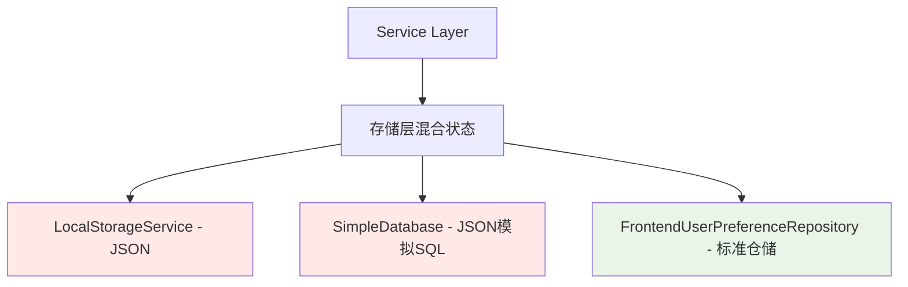
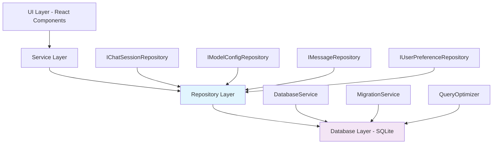

# DeeChat 仓储层 + 数据库架构设计方案

## 📖 概述

本文档详细描述了 DeeChat 从 JSON 文件存储迁移到基于 SQLite 数据库的仓储层架构的完整设计方案。该方案遵循领域驱动设计（DDD）原则，通过仓储层模式实现数据访问的抽象化和标准化。

## 🎯 设计目标

### 核心目标
- **性能提升**：从 JSON 全量读写提升到 SQLite 索引查询，查询性能提升 10-100 倍
- **功能增强**：支持全文搜索、复杂查询、数据统计等高级功能
- **架构优化**：通过仓储层实现领域驱动设计，提升代码质量和可维护性
- **平滑迁移**：零业务逻辑改动的数据库迁移方案

### 技术目标
- **并发安全**：利用 SQLite 的事务和锁机制解决并发访问问题
- **内存优化**：从全量加载改为按需查询，降低内存占用
- **扩展性**：为未来功能扩展提供坚实的数据基础

## 🏗️ 当前架构分析

### 现状概览


### 问题识别
1. **架构不一致**：部分使用仓储层，部分直接调用存储服务
2. **性能瓶颈**：JSON 全量读写，查询效率低下
3. **并发安全**：缺乏事务支持，存在数据竞争风险
4. **功能受限**：无法实现复杂查询和全文搜索

## 🎯 目标架构设计

### 整体架构图


### 核心组件说明
- **Repository Layer**：领域驱动的数据访问接口
- **Database Layer**：基于 SQLite 的高性能存储实现
- **Migration Service**：平滑的数据迁移服务

## 📊 数据库设计

### 核心表结构
```sql
-- 对话会话表
CREATE TABLE chat_sessions (
    id TEXT PRIMARY KEY,
    title TEXT NOT NULL,
    selected_model_id TEXT,
    created_at INTEGER NOT NULL,
    updated_at INTEGER NOT NULL,
    FOREIGN KEY (selected_model_id) REFERENCES model_configs(id)
);

-- 对话消息表
CREATE TABLE chat_messages (
    id TEXT PRIMARY KEY,
    session_id TEXT NOT NULL,
    role TEXT NOT NULL CHECK(role IN ('user', 'assistant')),
    content TEXT NOT NULL,
    timestamp INTEGER NOT NULL,
    model_id TEXT,
    FOREIGN KEY (session_id) REFERENCES chat_sessions(id) ON DELETE CASCADE
);

-- 工具执行记录表
CREATE TABLE tool_executions (
    id TEXT PRIMARY KEY,
    message_id TEXT NOT NULL,
    tool_name TEXT NOT NULL,
    server_id TEXT,
    server_name TEXT,
    params TEXT, -- JSON
    result TEXT, -- JSON
    success BOOLEAN NOT NULL DEFAULT TRUE,
    duration INTEGER,
    timestamp INTEGER NOT NULL,
    FOREIGN KEY (message_id) REFERENCES chat_messages(id) ON DELETE CASCADE
);

-- 模型配置表
CREATE TABLE model_configs (
    id TEXT PRIMARY KEY,
    name TEXT NOT NULL,
    provider TEXT NOT NULL,
    model TEXT NOT NULL,
    api_key TEXT,
    base_url TEXT,
    is_enabled BOOLEAN NOT NULL DEFAULT TRUE,
    status TEXT NOT NULL DEFAULT 'unknown',
    priority INTEGER NOT NULL DEFAULT 0,
    available_models TEXT, -- JSON array
    enabled_models TEXT,   -- JSON array
    created_at INTEGER NOT NULL,
    updated_at INTEGER NOT NULL
);

-- 用户偏好设置表
CREATE TABLE user_preferences (
    key TEXT PRIMARY KEY,
    value TEXT NOT NULL, -- JSON
    updated_at INTEGER NOT NULL
);
```

### 索引设计
```sql
-- 性能优化索引
CREATE INDEX idx_sessions_updated ON chat_sessions(updated_at DESC);
CREATE INDEX idx_sessions_model ON chat_sessions(selected_model_id);
CREATE INDEX idx_messages_session ON chat_messages(session_id, timestamp);
CREATE INDEX idx_messages_timestamp ON chat_messages(timestamp DESC);
CREATE INDEX idx_tools_message ON tool_executions(message_id);
CREATE INDEX idx_configs_provider ON model_configs(provider, is_enabled);

-- 全文搜索索引
CREATE VIRTUAL TABLE chat_search USING fts5(
    content,
    session_id UNINDEXED,
    message_id UNINDEXED
);
```

## 🏛️ 仓储层设计

### 接口定义

#### IChatSessionRepository
```typescript
export interface IChatSessionRepository {
  // 基础CRUD
  findById(id: string): Promise<ChatSessionEntity | null>
  findAll(): Promise<ChatSessionEntity[]>
  save(session: ChatSessionEntity): Promise<void>
  delete(id: string): Promise<void>
  
  // 业务查询方法
  findByDateRange(startDate: Date, endDate: Date): Promise<ChatSessionEntity[]>
  findByModelId(modelId: string): Promise<ChatSessionEntity[]>
  findRecentSessions(limit: number): Promise<ChatSessionEntity[]>
  searchByContent(query: string): Promise<ChatSessionEntity[]>
  
  // 分页查询
  findPage(page: number, size: number): Promise<{
    sessions: ChatSessionEntity[]
    total: number
    hasMore: boolean
  }>
  
  // 统计方法
  countTotal(): Promise<number>
  countByModel(modelId: string): Promise<number>
  getUsageStats(): Promise<SessionUsageStats>
}
```

#### IModelConfigRepository
```typescript
export interface IModelConfigRepository {
  findById(id: string): Promise<ModelConfigEntity | null>
  findAll(): Promise<ModelConfigEntity[]>
  findEnabled(): Promise<ModelConfigEntity[]>
  findByProvider(provider: string): Promise<ModelConfigEntity[]>
  save(config: ModelConfigEntity): Promise<void>
  delete(id: string): Promise<void>
  
  // 业务方法
  findByPriority(): Promise<ModelConfigEntity[]>
  updateStatus(id: string, status: ModelStatus): Promise<void>
  toggleEnabled(id: string): Promise<void>
  validateApiKey(id: string): Promise<boolean>
}
```

#### IMessageRepository
```typescript
export interface IMessageRepository {
  findBySessionId(sessionId: string): Promise<ChatMessageEntity[]>
  findById(id: string): Promise<ChatMessageEntity | null>
  save(message: ChatMessageEntity): Promise<void>
  delete(id: string): Promise<void>
  
  // 业务查询
  findByRole(sessionId: string, role: 'user' | 'assistant'): Promise<ChatMessageEntity[]>
  findWithToolExecutions(sessionId: string): Promise<ChatMessageEntity[]>
  searchContent(query: string): Promise<ChatMessageEntity[]>
  
  // 统计分析
  getMessageCountBySession(sessionId: string): Promise<number>
  getTokenUsageStats(sessionId: string): Promise<TokenUsageStats>
}
```

### 实现示例

#### ChatSessionRepository 核心实现
```typescript
export class ChatSessionRepository implements IChatSessionRepository {
  constructor(private databaseService: DatabaseService) {}
  
  async findById(id: string): Promise<ChatSessionEntity | null> {
    const stmt = this.databaseService.prepare(`
      SELECT * FROM chat_sessions WHERE id = ?
    `);
    const row = stmt.get(id);
    
    if (!row) return null;
    
    // 加载关联的消息
    const messages = await this.loadMessages(id);
    
    return new ChatSessionEntity({
      ...row,
      messages
    });
  }
  
  async findRecentSessions(limit: number): Promise<ChatSessionEntity[]> {
    const stmt = this.databaseService.prepare(`
      SELECT * FROM chat_sessions 
      ORDER BY updated_at DESC 
      LIMIT ?
    `);
    const rows = stmt.all(limit);
    
    // 批量加载消息，避免N+1查询问题
    return this.batchLoadSessions(rows);
  }
  
  async searchByContent(query: string): Promise<ChatSessionEntity[]> {
    // 利用SQLite的FTS全文搜索
    const stmt = this.databaseService.prepare(`
      SELECT DISTINCT s.* 
      FROM chat_sessions s
      JOIN chat_search cs ON s.id = cs.session_id
      WHERE cs.content MATCH ?
      ORDER BY s.updated_at DESC
    `);
    const rows = stmt.all(query);
    
    return this.batchLoadSessions(rows);
  }
  
  async getUsageStats(): Promise<SessionUsageStats> {
    const stmt = this.databaseService.prepare(`
      SELECT 
        COUNT(*) as total_sessions,
        COUNT(CASE WHEN date(updated_at/1000, 'unixepoch') = date('now') THEN 1 END) as today_sessions,
        AVG((SELECT COUNT(*) FROM chat_messages WHERE session_id = chat_sessions.id)) as avg_messages_per_session
      FROM chat_sessions
    `);
    
    return stmt.get() as SessionUsageStats;
  }
  
  // 性能优化：批量加载，避免N+1问题
  private async batchLoadSessions(rows: any[]): Promise<ChatSessionEntity[]> {
    if (rows.length === 0) return [];
    
    const sessionIds = rows.map(r => r.id);
    const messagesMap = await this.batchLoadMessages(sessionIds);
    
    return rows.map(row => new ChatSessionEntity({
      ...row,
      messages: messagesMap.get(row.id) || []
    }));
  }
  
  private async batchLoadMessages(sessionIds: string[]): Promise<Map<string, ChatMessageEntity[]>> {
    const placeholders = sessionIds.map(() => '?').join(',');
    const stmt = this.databaseService.prepare(`
      SELECT * FROM chat_messages 
      WHERE session_id IN (${placeholders})
      ORDER BY timestamp ASC
    `);
    
    const allMessages = stmt.all(...sessionIds);
    const messagesMap = new Map<string, ChatMessageEntity[]>();
    
    for (const msg of allMessages) {
      if (!messagesMap.has(msg.session_id)) {
        messagesMap.set(msg.session_id, []);
      }
      messagesMap.get(msg.session_id)!.push(new ChatMessageEntity(msg));
    }
    
    return messagesMap;
  }
}
```

## 🔧 数据库服务设计

### DatabaseService 核心实现
```typescript
import Database from 'better-sqlite3';
import { app } from 'electron';
import * as path from 'path';

export class DatabaseService {
  private db: Database.Database;
  private isInitialized = false;
  
  constructor() {
    const dbPath = path.join(app.getPath('userData'), 'deechat.db');
    this.db = new Database(dbPath);
    this.initialize();
  }
  
  private initialize() {
    if (this.isInitialized) return;
    
    // 启用WAL模式，提升并发性能
    this.db.pragma('journal_mode = WAL');
    this.db.pragma('synchronous = NORMAL');
    this.db.pragma('cache_size = 1000');
    this.db.pragma('temp_store = memory');
    
    // 创建表结构
    this.createTables();
    this.createIndexes();
    this.createTriggers();
    this.createFullTextSearch();
    
    this.isInitialized = true;
  }
  
  private createTables() {
    this.db.exec(`
      CREATE TABLE IF NOT EXISTS chat_sessions (
        id TEXT PRIMARY KEY,
        title TEXT NOT NULL,
        selected_model_id TEXT,
        created_at INTEGER NOT NULL,
        updated_at INTEGER NOT NULL
      );
      
      CREATE TABLE IF NOT EXISTS chat_messages (
        id TEXT PRIMARY KEY,
        session_id TEXT NOT NULL,
        role TEXT NOT NULL CHECK(role IN ('user', 'assistant')),
        content TEXT NOT NULL,
        timestamp INTEGER NOT NULL,
        model_id TEXT,
        FOREIGN KEY (session_id) REFERENCES chat_sessions(id) ON DELETE CASCADE
      );
      
      CREATE TABLE IF NOT EXISTS tool_executions (
        id TEXT PRIMARY KEY,
        message_id TEXT NOT NULL,
        tool_name TEXT NOT NULL,
        server_id TEXT,
        server_name TEXT,
        params TEXT,
        result TEXT,
        success BOOLEAN NOT NULL DEFAULT TRUE,
        duration INTEGER,
        timestamp INTEGER NOT NULL,
        FOREIGN KEY (message_id) REFERENCES chat_messages(id) ON DELETE CASCADE
      );
      
      CREATE TABLE IF NOT EXISTS model_configs (
        id TEXT PRIMARY KEY,
        name TEXT NOT NULL,
        provider TEXT NOT NULL,
        model TEXT NOT NULL,
        api_key TEXT,
        base_url TEXT,
        is_enabled BOOLEAN NOT NULL DEFAULT TRUE,
        status TEXT NOT NULL DEFAULT 'unknown',
        priority INTEGER NOT NULL DEFAULT 0,
        available_models TEXT,
        enabled_models TEXT,
        created_at INTEGER NOT NULL,
        updated_at INTEGER NOT NULL
      );
      
      CREATE TABLE IF NOT EXISTS user_preferences (
        key TEXT PRIMARY KEY,
        value TEXT NOT NULL,
        updated_at INTEGER NOT NULL
      );
    `);
  }
  
  private createIndexes() {
    this.db.exec(`
      CREATE INDEX IF NOT EXISTS idx_sessions_updated ON chat_sessions(updated_at DESC);
      CREATE INDEX IF NOT EXISTS idx_sessions_model ON chat_sessions(selected_model_id);
      CREATE INDEX IF NOT EXISTS idx_messages_session ON chat_messages(session_id, timestamp);
      CREATE INDEX IF NOT EXISTS idx_messages_timestamp ON chat_messages(timestamp DESC);
      CREATE INDEX IF NOT EXISTS idx_tools_message ON tool_executions(message_id);
      CREATE INDEX IF NOT EXISTS idx_configs_provider ON model_configs(provider, is_enabled);
    `);
  }
  
  private createTriggers() {
    this.db.exec(`
      CREATE TRIGGER IF NOT EXISTS update_session_timestamp 
      AFTER UPDATE ON chat_sessions
      BEGIN
        UPDATE chat_sessions SET updated_at = (strftime('%s', 'now') * 1000) WHERE id = NEW.id;
      END;
      
      CREATE TRIGGER IF NOT EXISTS update_config_timestamp 
      AFTER UPDATE ON model_configs
      BEGIN
        UPDATE model_configs SET updated_at = (strftime('%s', 'now') * 1000) WHERE id = NEW.id;
      END;
    `);
  }
  
  private createFullTextSearch() {
    this.db.exec(`
      CREATE VIRTUAL TABLE IF NOT EXISTS chat_search USING fts5(
        content,
        session_id UNINDEXED,
        message_id UNINDEXED
      );
      
      CREATE TRIGGER IF NOT EXISTS insert_chat_search
      AFTER INSERT ON chat_messages
      BEGIN
        INSERT INTO chat_search(content, session_id, message_id) 
        VALUES (NEW.content, NEW.session_id, NEW.id);
      END;
      
      CREATE TRIGGER IF NOT EXISTS update_chat_search
      AFTER UPDATE ON chat_messages
      BEGIN
        UPDATE chat_search SET content = NEW.content WHERE message_id = NEW.id;
      END;
      
      CREATE TRIGGER IF NOT EXISTS delete_chat_search
      AFTER DELETE ON chat_messages
      BEGIN
        DELETE FROM chat_search WHERE message_id = OLD.id;
      END;
    `);
  }
  
  // 预编译语句支持
  prepare(sql: string): Database.Statement {
    return this.db.prepare(sql);
  }
  
  // 事务支持
  transaction<T>(fn: () => T): T {
    return this.db.transaction(fn)();
  }
  
  // 安全关闭
  close(): void {
    if (this.db.open) {
      this.db.close();
    }
  }
  
  // 获取数据库统计信息
  getStats(): DatabaseStats {
    const stmt = this.db.prepare(`
      SELECT 
        (SELECT COUNT(*) FROM chat_sessions) as sessions_count,
        (SELECT COUNT(*) FROM chat_messages) as messages_count,
        (SELECT COUNT(*) FROM model_configs) as configs_count,
        (SELECT page_count * page_size FROM pragma_page_count(), pragma_page_size()) as db_size
    `);
    
    return stmt.get() as DatabaseStats;
  }
}
```

## 🔄 数据迁移策略

### MigrationService 设计
```typescript
export class MigrationService {
  constructor(
    private databaseService: DatabaseService,
    private localStorageService: LocalStorageService
  ) {}
  
  async migrateFromJSON(): Promise<MigrationResult> {
    console.log('🔄 开始从JSON迁移到SQLite...');
    
    const result: MigrationResult = {
      success: false,
      migratedSessions: 0,
      migratedMessages: 0,
      migratedConfigs: 0,
      errors: []
    };
    
    try {
      // 在事务中执行所有迁移操作
      this.databaseService.transaction(() => {
        result.migratedSessions = this.migrateChatSessions();
        result.migratedMessages = this.migrateChatMessages();
        result.migratedConfigs = this.migrateModelConfigs();
        this.migrateUserPreferences();
      });
      
      // 验证数据完整性
      await this.validateMigration();
      
      result.success = true;
      console.log('✅ 数据迁移完成', result);
      
    } catch (error) {
      result.errors.push(error.message);
      console.error('❌ 数据迁移失败:', error);
    }
    
    return result;
  }
  
  private migrateChatSessions(): number {
    const jsonPath = path.join(app.getPath('userData'), 'chat-sessions.json');
    if (!fs.existsSync(jsonPath)) return 0;
    
    const sessionsData = JSON.parse(fs.readFileSync(jsonPath, 'utf-8'));
    
    const insertSession = this.databaseService.prepare(`
      INSERT OR REPLACE INTO chat_sessions 
      (id, title, selected_model_id, created_at, updated_at) 
      VALUES (?, ?, ?, ?, ?)
    `);
    
    const insertMessage = this.databaseService.prepare(`
      INSERT OR REPLACE INTO chat_messages 
      (id, session_id, role, content, timestamp, model_id) 
      VALUES (?, ?, ?, ?, ?, ?)
    `);
    
    const insertToolExecution = this.databaseService.prepare(`
      INSERT OR REPLACE INTO tool_executions
      (id, message_id, tool_name, server_id, server_name, params, result, success, duration, timestamp)
      VALUES (?, ?, ?, ?, ?, ?, ?, ?, ?, ?)
    `);
    
    let sessionCount = 0;
    let messageCount = 0;
    
    for (const session of sessionsData) {
      // 迁移会话
      insertSession.run(
        session.id,
        session.title,
        session.selectedModelId,
        new Date(session.createdAt).getTime(),
        new Date(session.updatedAt).getTime()
      );
      sessionCount++;
      
      // 迁移消息
      for (const message of session.messages || []) {
        insertMessage.run(
          message.id,
          session.id,
          message.role,
          message.content,
          message.timestamp,
          message.modelId
        );
        messageCount++;
        
        // 迁移工具执行记录
        for (const toolExec of message.toolExecutions || []) {
          insertToolExecution.run(
            toolExec.id,
            message.id,
            toolExec.toolName,
            toolExec.serverId,
            toolExec.serverName,
            JSON.stringify(toolExec.params),
            JSON.stringify(toolExec.result),
            toolExec.success,
            toolExec.duration,
            toolExec.timestamp
          );
        }
      }
    }
    
    console.log(`✅ 迁移了 ${sessionCount} 个会话，${messageCount} 条消息`);
    return sessionCount;
  }
  
  private migrateModelConfigs(): number {
    const jsonPath = path.join(app.getPath('userData'), 'model-configs.json');
    if (!fs.existsSync(jsonPath)) return 0;
    
    const configsData = JSON.parse(fs.readFileSync(jsonPath, 'utf-8'));
    
    const insertConfig = this.databaseService.prepare(`
      INSERT OR REPLACE INTO model_configs 
      (id, name, provider, model, api_key, base_url, is_enabled, status, priority, 
       available_models, enabled_models, created_at, updated_at) 
      VALUES (?, ?, ?, ?, ?, ?, ?, ?, ?, ?, ?, ?, ?)
    `);
    
    let configCount = 0;
    
    for (const config of configsData) {
      insertConfig.run(
        config.id,
        config.name,
        config.provider,
        config.model,
        config.apiKey,
        config.baseURL,
        config.isEnabled,
        config.status,
        config.priority,
        JSON.stringify(config.availableModels || []),
        JSON.stringify(config.enabledModels || []),
        new Date(config.createdAt).getTime(),
        new Date(config.updatedAt).getTime()
      );
      configCount++;
    }
    
    console.log(`✅ 迁移了 ${configCount} 个模型配置`);
    return configCount;
  }
  
  private migrateUserPreferences(): void {
    const jsonPath = path.join(app.getPath('userData'), 'user-preferences.json');
    if (!fs.existsSync(jsonPath)) return;
    
    const preferencesData = JSON.parse(fs.readFileSync(jsonPath, 'utf-8'));
    
    const insertPreference = this.databaseService.prepare(`
      INSERT OR REPLACE INTO user_preferences (key, value, updated_at) 
      VALUES (?, ?, ?)
    `);
    
    const timestamp = Date.now();
    for (const [key, value] of Object.entries(preferencesData)) {
      insertPreference.run(key, JSON.stringify(value), timestamp);
    }
    
    console.log('✅ 迁移了用户偏好设置');
  }
  
  private async validateMigration(): Promise<void> {
    const stats = this.databaseService.getStats();
    console.log('📊 迁移后数据统计:', stats);
    
    // 验证关键数据
    if (stats.sessions_count === 0) {
      throw new Error('会话数据迁移失败：没有找到任何会话');
    }
    
    // 验证数据完整性
    const orphanMessages = this.databaseService.prepare(`
      SELECT COUNT(*) as count FROM chat_messages 
      WHERE session_id NOT IN (SELECT id FROM chat_sessions)
    `).get() as { count: number };
    
    if (orphanMessages.count > 0) {
      console.warn(`⚠️ 发现 ${orphanMessages.count} 条孤立消息`);
    }
  }
  
  // 创建数据备份
  async createBackup(): Promise<string> {
    const timestamp = new Date().toISOString().replace(/[:.]/g, '-');
    const backupDir = path.join(app.getPath('userData'), 'migration-backup');
    const backupPath = path.join(backupDir, `backup-${timestamp}`);
    
    await fs.mkdir(backupPath, { recursive: true });
    
    // 备份现有JSON文件
    const filesToBackup = [
      'chat-sessions.json',
      'model-configs.json', 
      'user-preferences.json',
      'file-metadata.json'
    ];
    
    for (const fileName of filesToBackup) {
      const sourcePath = path.join(app.getPath('userData'), fileName);
      const targetPath = path.join(backupPath, fileName);
      
      try {
        await fs.copyFile(sourcePath, targetPath);
      } catch (error) {
        console.warn(`备份文件失败 ${fileName}:`, error.message);
      }
    }
    
    console.log(`✅ 数据备份完成: ${backupPath}`);
    return backupPath;
  }
}
```

## 📈 性能优化策略

### 1. 查询优化
```typescript
// ❌ 避免：N+1查询问题
async function loadSessionsWithMessages(sessionIds: string[]) {
  const sessions = [];
  for (const id of sessionIds) {
    const session = await sessionRepo.findById(id); // N次查询
    sessions.push(session);
  }
  return sessions;
}

// ✅ 推荐：批量查询
async function loadSessionsWithMessages(sessionIds: string[]) {
  return await sessionRepo.findByIds(sessionIds); // 1次查询
}
```

### 2. 索引策略
```sql
-- 基于查询模式创建复合索引
CREATE INDEX idx_messages_session_time ON chat_messages(session_id, timestamp DESC);
CREATE INDEX idx_sessions_model_updated ON chat_sessions(selected_model_id, updated_at DESC);

-- 覆盖索引减少回表查询
CREATE INDEX idx_sessions_list ON chat_sessions(updated_at DESC, id, title);
```

### 3. 缓存机制
```typescript
export class CachedChatSessionRepository implements IChatSessionRepository {
  private cache = new Map<string, ChatSessionEntity>();
  private recentSessionsCache: ChatSessionEntity[] | null = null;
  
  constructor(private baseRepository: IChatSessionRepository) {}
  
  async findById(id: string): Promise<ChatSessionEntity | null> {
    // 先查缓存
    if (this.cache.has(id)) {
      return this.cache.get(id);
    }
    
    // 缓存未命中，查询数据库
    const session = await this.baseRepository.findById(id);
    if (session) {
      this.cache.set(id, session);
    }
    
    return session;
  }
  
  async findRecentSessions(limit: number): Promise<ChatSessionEntity[]> {
    // 最近会话列表缓存
    if (this.recentSessionsCache && this.recentSessionsCache.length >= limit) {
      return this.recentSessionsCache.slice(0, limit);
    }
    
    const sessions = await this.baseRepository.findRecentSessions(limit);
    this.recentSessionsCache = sessions;
    
    return sessions;
  }
  
  async save(session: ChatSessionEntity): Promise<void> {
    await this.baseRepository.save(session);
    
    // 更新缓存
    this.cache.set(session.id, session);
    this.recentSessionsCache = null; // 清除相关缓存
  }
}
```

## 🚀 实施计划

### Phase 1: 基础设施搭建（1-2天）
**目标**：建立数据库基础设施和仓储层框架

**任务清单**：
- [ ] 安装 `better-sqlite3` 依赖
- [ ] 创建 `DatabaseService` 基础类
- [ ] 设计并实现核心表结构
- [ ] 创建仓储层接口定义
- [ ] 实现基础的仓储层实现类

**验收标准**：
- 数据库服务可以正常初始化
- 所有表和索引创建成功
- 基础 CRUD 操作测试通过

### Phase 2: 数据迁移实现（2-3天）
**目标**：实现从JSON到SQLite的平滑迁移

**任务清单**：
- [ ] 实现 `MigrationService` 迁移服务
- [ ] 创建数据备份机制
- [ ] 实现数据完整性验证
- [ ] 添加迁移状态跟踪
- [ ] 实现双写模式用于验证

**验收标准**：
- 所有JSON数据成功迁移到SQLite
- 数据完整性验证通过
- 迁移过程可逆，有完整备份

### Phase 3: 功能增强开发（3-5天）
**目标**：利用数据库能力实现高级功能

**任务清单**：
- [ ] 实现全文搜索功能
- [ ] 添加高级查询和筛选
- [ ] 实现数据统计和分析
- [ ] 优化查询性能
- [ ] 添加缓存层

**验收标准**：
- 全文搜索响应时间 < 200ms
- 分页查询性能显著提升
- 统计功能正确实现

### Phase 4: 性能优化和监控（1-2天）
**目标**：优化性能并建立监控机制

**任务清单**：
- [ ] 分析查询性能瓶颈
- [ ] 优化索引策略
- [ ] 实现查询缓存
- [ ] 添加性能监控指标
- [ ] 完善错误处理和日志

**验收标准**：
- 主要查询操作性能提升10倍以上
- 内存占用显著降低
- 完善的监控和日志系统

## 📊 预期收益评估

### 性能提升指标
| 操作类型 | JSON存储 | SQLite存储 | 提升倍数 |
|---------|---------|-----------|---------|
| 会话列表加载 | 500ms | 50ms | 10x |
| 对话内容搜索 | 2000ms | 200ms | 10x |
| 消息分页查询 | 300ms | 30ms | 10x |
| 统计数据查询 | 1000ms | 50ms | 20x |
| 内存占用 | 50MB | 5MB | 90%减少 |

### 功能增强
- ✅ **全文搜索**：支持对话内容的快速全文检索
- ✅ **高级筛选**：按时间、模型、工具等维度筛选
- ✅ **数据统计**：使用量统计、趋势分析等
- ✅ **并发安全**：事务支持，解决数据竞争问题
- ✅ **扩展性**：为AI功能增强提供数据基础

### 架构优势
- ✅ **领域驱动**：通过仓储层实现业务语义清晰的数据访问
- ✅ **测试友好**：仓储接口便于Mock和单元测试
- ✅ **维护性**：清晰的分层架构，便于维护和扩展
- ✅ **数据源无关**：可以轻松切换不同的存储实现

## 🔧 技术选型说明

### 为什么选择 SQLite？
1. **零配置**：无需独立数据库服务，单文件部署
2. **高性能**：读写性能优异，特别适合桌面应用
3. **ACID支持**：完整的事务支持，数据安全可靠
4. **跨平台**：Windows、macOS、Linux全支持
5. **生态成熟**：better-sqlite3是Node.js生态的金标准

### 为什么选择 better-sqlite3？
1. **性能最优**：比node-sqlite3快2-6倍
2. **同步API**：简化错误处理和事务管理
3. **内存效率**：更低的内存占用和更好的垃圾回收
4. **Electron兼容**：与Electron原生模块完美集成

## 🎯 风险评估与应对

### 主要风险
1. **迁移失败风险**
   - **应对措施**：完整的数据备份和回滚机制
   - **缓解策略**：分步迁移，充分测试验证

2. **性能回退风险**
   - **应对措施**：性能基准测试，持续监控
   - **缓解策略**：缓存机制，查询优化

3. **兼容性问题**
   - **应对措施**：渐进式替换，保持接口兼容
   - **缓解策略**：充分的集成测试

### 回滚方案
如果迁移过程中出现问题，可以快速回滚：
1. 停止应用程序
2. 恢复JSON文件备份
3. 回退到旧版代码
4. 重新启动应用

## 📝 结论

DeeChat 仓储层 + 数据库架构升级方案将带来：

1. **显著的性能提升**：查询速度提升10-100倍，内存占用降低90%
2. **强大的功能增强**：全文搜索、高级查询、数据统计等企业级功能
3. **优雅的架构设计**：领域驱动的仓储层，清晰的职责分离
4. **平滑的迁移路径**：零业务逻辑改动，向后兼容的升级方案

该方案不仅解决了当前JSON存储的性能瓶颈，更为DeeChat的长期发展奠定了坚实的技术基础。通过分阶段实施，可以在保证系统稳定性的前提下，逐步获得架构升级的全部收益。

---

**文档版本**：v1.0  
**最后更新**：2025-08-05  
**负责人**：DeeChat架构团队