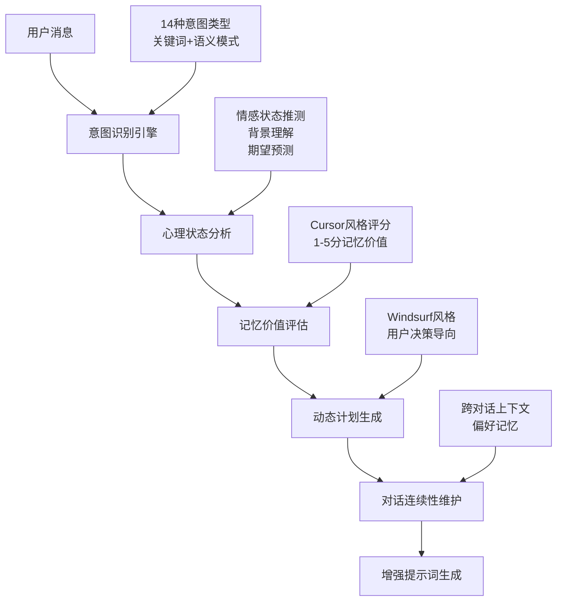

# DeeChat 智能意图识别系统

> **下一代AI对话的核心技术 - Theory of Mind + 意图识别 + 动态规划**
> 
> 📅 创建时间: 2025-08-06  
> 🔄 版本: v1.0.0  
> 🧠 架构: Cursor记忆系统 + Windsurf规划机制 + 原创意图分类

---

## 📋 目录

- [1. 系统概述](#1-系统概述)
- [2. 意图分类体系](#2-意图分类体系)
- [3. Theory of Mind实现](#3-theory-of-mind实现)
- [4. 记忆评估系统](#4-记忆评估系统)
- [5. 动态计划机制](#5-动态计划机制)
- [6. 对话连续性管理](#6-对话连续性管理)
- [7. 技术实现细节](#7-技术实现细节)
- [8. 使用示例](#8-使用示例)

---

## 1. 系统概述

### 🧠 核心理念

DeeChat的智能意图识别系统基于**Theory of Mind（心智理论）**，能够：

- 🎯 **精准识别**用户的真实意图（14种意图类型）
- 🧠 **主动理解**用户的心理状态和情感倾向
- 💭 **预测期望**用户想要达成的目标和担忧的问题
- 📚 **智能记忆**有价值的交互内容（Cursor风格1-5分评分）
- 📋 **动态规划**后续行动建议（Windsurf风格计划更新）

### 🏗️ 三层智能架构



### ⚡ 核心优势

| 特性 | 传统AI | DeeChat智能系统 |
|------|-------|----------------|
| **意图理解** | 关键词匹配 | 14种意图类型+语义模式识别 |
| **用户理解** | 字面理解 | Theory of Mind心理状态分析 |
| **记忆管理** | 简单存储 | Cursor风格智能评分(1-5分) |
| **行动规划** | 被动响应 | Windsurf风格动态计划更新 |
| **对话连续性** | 上下文窗口 | 跨对话智能记忆和偏好学习 |

---

## 2. 意图分类体系

### 🎯 14种用户意图类型

DeeChat创新性地将用户意图分为4个大类，14个具体类型：

#### 2.1 技术实现类

| 意图类型 | 英文标识 | 典型特征 | 置信度阈值 | 处理策略 |
|----------|----------|----------|------------|----------|
| **编程实现** | `CODING` | 实现功能、编写代码、调试程序 | 0.8 | 技术栈选择→方案确认→代码实现 |
| **问题调试** | `DEBUGGING` | 错误修复、问题诊断、故障排除 | 0.85 | 错误收集→根因分析→解决方案选择 |
| **架构设计** | `ARCHITECTURE` | 系统设计、技术选型、架构决策 | 0.75 | 多方案对比→优劣分析→用户决策 |

#### 2.2 工具操作类

| 意图类型 | 英文标识 | 典型特征 | 置信度阈值 | 处理策略 |
|----------|----------|----------|------------|----------|
| **工具激活** | `TOOL_ACTIVATION` | 角色激活、工具调用、能力切换 | 0.9 | 立即执行，不需要额外确认 |
| **资源查询** | `RESOURCE_QUERY` | 能力发现、工具列表、角色浏览 | 0.85 | 展示完整信息，提供使用指导 |
| **配置设置** | `CONFIGURATION` | 系统配置、参数调整、设置修改 | 0.8 | 风险说明→选项展示→用户确认 |

#### 2.3 信息查询类

| 意图类型 | 英文标识 | 典型特征 | 置信度阈值 | 处理策略 |
|----------|----------|----------|------------|----------|
| **概念解释** | `EXPLANATION` | 知识查询、概念解释、原理说明 | 0.7 | 清晰解释→实例说明→追问细节 |
| **深度研究** | `RESEARCH` | 学术分析、深入调研、全面了解 | 0.75 | 研究重点询问→全面分析 |
| **对比分析** | `COMPARISON` | 方案对比、选择评估、优劣分析 | 0.75 | 客观对比表格→决策支持 |

#### 2.4 对话交互类

| 意图类型 | 英文标识 | 典型特征 | 置信度阈值 | 处理策略 |
|----------|----------|----------|------------|----------|
| **轻松交流** | `CASUAL_CHAT` | 闲聊、问候、轻松对话 | 0.8 | 友好回应→保持交流节奏 |
| **反馈纠错** | `FEEDBACK` | 用户纠错、意见反馈、质量评价 | 0.9 | 立即承认→感谢纠错→记忆存储 |
| **计划制定** | `PLANNING` | 项目规划、任务分解、流程设计 | 0.8 | 计划草案→用户审核→细化执行 |

#### 2.5 特殊类型

| 意图类型 | 英文标识 | 典型特征 | 置信度阈值 | 处理策略 |
|----------|----------|----------|------------|----------|
| **意图不明** | `UNCLEAR` | 模糊表达、不清晰需求 | 0.3 | 礼貌询问→选项提供→澄清引导 |
| **复杂任务** | `COMPLEX` | 多步骤、多方面的综合任务 | 0.6 | 任务分解→计划展示→逐步执行 |

### 🔍 意图识别算法

#### 关键词模式匹配

```typescript
// 高优先级意图识别（工具激活）
const TOOL_ACTIVATION_PATTERNS = [
  'activate', 'action', '激活', '切换', 'switch to', '使用.*角色',
  'promptx.*action', 'call.*tool', '执行.*工具'
];

// 调试类意图识别
const DEBUGGING_PATTERNS = [
  'debug', 'fix.*error', '修复.*问题', 'troubleshoot', '解决.*bug',
  'why.*not.*work', '为什么.*不.*工作', 'error.*occurred', '出现.*错误'
];
```

#### 复杂任务检测

```typescript
private isComplexRequest(message: string): boolean {
  const complexIndicators = [
    message.length > 200,  // 长消息
    (message.match(/\band\b/gi) || []).length > 3,  // 多个"and"
    (message.match(/[,;]/g) || []).length > 3,      // 多个分隔符
    /step.*\d.*step|phase.*\d.*phase/i.test(message), // 多步骤
    /first.*then.*finally|initially.*subsequently.*ultimately/i.test(message) // 时序词
  ];
  
  return complexIndicators.filter(Boolean).length >= 2;
}
```

---

## 3. Theory of Mind实现

### 🧠 心理状态理解系统

Theory of Mind让DeeChat能够主动理解和推测用户的心理状态：

#### 3.1 用户心理状态分析

```yaml
基于意图的心理状态推测:
  DEBUGGING:
    状态: "可能感到困扰，需要技术支持"
    情绪: "可能焦虑或急迫 - 需要快速有效的解决方案"
    期望: "问题的根本原因 + 具体解决步骤"
    关注点: ["时间成本", "是否会引入新问题", "根本解决vs临时修复"]

  COMPLEX:
    状态: "面临复杂挑战，需要分步指导"
    情绪: "可能压力较大 - 需要分解任务减轻认知负担"
    期望: "详细可行的行动计划 + 时间预估"
    关注点: ["任务可行性", "资源需求", "执行难度"]

  TOOL_ACTIVATION:
    状态: "有明确目标，希望快速获得专业能力"
    情绪: "目标导向 - 希望快速获得能力"
    期望: "立即获得专业角色能力"
    关注点: ["工具使用的安全性", "对现有系统的影响"]
```

#### 3.2 情感状态感知

```typescript
private getEmotionalState(context: ConversationContext): string {
  if (context.isFrustration) return '**挫败或困扰** - 需要耐心和积极的支持';
  if (context.isCorrection) return '**需要准确理解** - 用户希望得到正确的回应';
  
  const emotionMap: Partial<Record<UserIntentType, string>> = {
    [UserIntentType.DEBUGGING]: '可能**焦虑或急迫** - 需要快速有效的解决方案',
    [UserIntentType.COMPLEX]: '可能**压力较大** - 需要分解任务减轻认知负担',
    [UserIntentType.TOOL_ACTIVATION]: '**目标导向** - 希望快速获得能力',
    [UserIntentType.RESOURCE_QUERY]: '**探索状态** - 对新可能性感兴趣',
    [UserIntentType.CASUAL_CHAT]: '**轻松愉快** - 享受交流过程',
    [UserIntentType.FEEDBACK]: '**认真专注** - 重视准确性和质量'
  };

  return emotionMap[context.detectedIntent] || '**中性状态** - 保持专业友好';
}
```

#### 3.3 用户期望预测

基于意图类型和上下文，系统能够预测用户的期望结果：

| 意图类型 | 预测的用户期望 | 潜在关注点 |
|----------|----------------|------------|
| `CODING` | 可运行的代码 + 清晰的解释 | 代码质量、性能、维护性 |
| `DEBUGGING` | 问题的根本原因 + 具体解决步骤 | 时间成本、副作用风险 |
| `ARCHITECTURE` | 多个方案选择 + 优劣分析 + 推荐建议 | 扩展性、技术债务、团队匹配 |
| `FEEDBACK` | 认真对待 + 改进承诺 + 感谢确认 | AI是否真正理解了反馈 |

---

## 4. 记忆评估系统

### 💾 Cursor风格智能记忆评分

DeeChat采用1-5分的记忆价值评估系统，智能决定哪些信息值得长期记忆：

#### 4.1 评分标准

```yaml
记忆评分标准 (1-5分):
  5分 - 核心记忆: 用户明确要求记忆的信息、用户纠错信息
  4分 - 重要记忆: 工作流偏好、通用可操作规则
  3分 - 基础记忆: 普通交互内容（默认分数）
  2分 - 临时记忆: 任务特定信息、模糊描述
  1分 - 低价值记忆: 显而易见信息、特定文件操作
```

#### 4.2 评分算法

```typescript
private evaluateMemoryValue(message: string, intent: UserIntentType): {
  score: number;
  reason: string;
  forceRemember: boolean;
} {
  const criteria = this.analyzeMemoryFactors(message, intent);
  let score = 3; // 基础分数
  let reasons: string[] = [];
  let forceRemember = false;
  
  // 正面因素加分
  if (criteria.isCorrection) {
    score += 2;
    reasons.push('用户纠错信息');
    forceRemember = true; // 用户纠错必须记住
  }
  
  if (criteria.expressesFrustration) {
    score += 1;
    reasons.push('用户挫败感表达');
    forceRemember = true;
  }
  
  if (criteria.isWorkflowPreference) {
    score += 1;
    reasons.push('工作流偏好');
  }
  
  // 负面因素减分
  if (criteria.isFileSpecific) {
    score -= 2;
    reasons.push('特定文件相关');
  }
  
  if (criteria.isObvious) {
    score -= 2;
    reasons.push('显而易见的信息');
  }
  
  // 特殊情况：用户明确要求记住
  if (message.toLowerCase().includes('remember') || 
      message.includes('记住') || 
      message.includes('保存')) {
    score = 5;
    forceRemember = true;
    reasons = ['用户明确要求记忆'];
  }
  
  // 分数范围限制
  score = Math.max(1, Math.min(5, score));
  
  return {
    score,
    reason: reasons.join(', ') || '标准评估',
    forceRemember
  };
}
```

#### 4.3 记忆因素分析

```typescript
interface MemoryEvaluationCriteria {
  // 正面因素 (+分)
  isGeneral: boolean;      // 通用性规则
  isActionable: boolean;   // 可操作性
  isCorrection: boolean;   // 用户纠错
  expressesFrustration: boolean; // 表达挫败感
  isWorkflowPreference: boolean; // 工作流偏好
  
  // 负面因素 (-分)
  isFileSpecific: boolean;    // 特定文件相关
  isTaskSpecific: boolean;    // 特定任务相关
  isObvious: boolean;         // 显而易见的
  isVague: boolean;           // 模糊不清的
  isTemporary: boolean;       // 临时性的
}
```

---

## 5. 动态计划机制

### 📋 Windsurf风格动态计划更新

DeeChat基于用户意图动态生成行动建议，始终保持"用户是决策者"的原则：

#### 5.1 基于意图的行动规划

```typescript
private analyzePlanNeeds(message: string, intent: UserIntentType): {
  needsUpdate: boolean;
  suggestedActions: string[];
} {
  const suggestedActions: string[] = [];
  let needsUpdate = false;
  
  // 根据意图类型提供建议（以用户为决策者的语言）
  switch (intent) {
    case UserIntentType.TOOL_ACTIVATION:
      suggestedActions.push('询问是否调用promptx_action工具激活角色');
      suggestedActions.push('激活后询问是否学习角色相关资源');
      break;
      
    case UserIntentType.CODING:
      suggestedActions.push('分析需求并提供技术栈选择');
      suggestedActions.push('制定实现计划草案，等待用户确认');
      suggestedActions.push('用户确认后开始编码实现');
      needsUpdate = true;
      break;
      
    case UserIntentType.DEBUGGING:
      suggestedActions.push('收集错误信息并展示给用户');
      suggestedActions.push('分析问题根本原因，提供诊断结果');
      suggestedActions.push('提供多种解决方案让用户选择');
      break;
      
    case UserIntentType.COMPLEX:
      suggestedActions.push('分解复杂任务为子步骤，展示给用户');
      suggestedActions.push('制定详细执行计划，等待用户审核');
      suggestedActions.push('用户同意后按步骤逐一执行');
      needsUpdate = true;
      break;
      
    case UserIntentType.FEEDBACK:
      if (this.currentContext) {
        suggestedActions.push('立即承认并感谢用户纠错');
        suggestedActions.push('记录用户纠错信息到记忆系统');
        suggestedActions.push('询问是否需要调整当前执行策略');
        needsUpdate = true;
      }
      break;
  }
  
  return { needsUpdate, suggestedActions };
}
```

#### 5.2 行动建议特点

**用户决策导向的建议语言:**
- ✅ "询问是否..." - 始终征求用户意见
- ✅ "提供选择让用户..." - 保证用户有选择权
- ✅ "等待用户确认" - 在关键决策点暂停
- ✅ "用户同意后..." - 明确需要用户同意

**避免的表达方式:**
- ❌ "直接执行..." - 不给用户选择机会
- ❌ "立即实施..." - 跳过用户决策环节
- ❌ "自动调整..." - 没有征求用户意见

---

## 6. 对话连续性管理

### 🔄 跨对话的智能上下文保持

DeeChat能够维护跨对话的连续性，学习用户偏好和工作模式：

#### 6.1 对话模式分析

```typescript
private analyzeContinuity(contexts: ConversationContext[]): {
  patterns: string[];
  preferences: string[];
  topicContinuity: string;
  styleConsistency: string;
  hasCorrections: boolean;
} {
  const patterns: string[] = [];
  const preferences: string[] = [];
  let hasCorrections = false;

  // 分析意图模式
  const intentCounts: Record<string, number> = {};
  contexts.forEach(ctx => {
    intentCounts[ctx.detectedIntent] = (intentCounts[ctx.detectedIntent] || 0) + 1;
    if (ctx.isCorrection) hasCorrections = true;
  });

  const dominantIntent = Object.keys(intentCounts).reduce((a, b) => 
    intentCounts[a] > intentCounts[b] ? a : b
  );

  if (intentCounts[dominantIntent] > 1) {
    patterns.push(`偏好${this.getIntentDisplayName(dominantIntent as UserIntentType)}类型的交互`);
  }

  // 分析工具使用模式
  const toolUsers = contexts.filter(ctx => ctx.requiresTools);
  if (toolUsers.length > 0) {
    patterns.push('倾向于使用工具增强的解决方案');
  }

  // 分析记忆模式
  const highValueMemories = contexts.filter(ctx => ctx.memoryScore >= 4);
  if (highValueMemories.length > 0) {
    patterns.push('提供了有价值的个人偏好信息');
  }

  return {
    patterns,
    preferences,
    topicContinuity: '保持在相关技术领域的深度交流',
    styleConsistency: '维持专业而友好的交流风格',
    hasCorrections
  };
}
```

#### 6.2 连续性提示词生成

```typescript
private buildContinuitySegment(): PromptSegment | null {
  if (!this.currentSession) return null;

  const history = conversationContextAnalyzer.getConversationHistory();
  if (history.length === 0) return null;

  const recentContexts = history.slice(-3); // 最近3轮对话
  const continuityInsights = this.analyzeContinuity(recentContexts);

  return {
    id: 'conversation-continuity',
    content: `## 对话连续性分析 🔄

### 对话轮次：第 ${this.currentSession.conversationTurn} 轮

### 近期对话模式：
${continuityInsights.patterns.map(pattern => `- ${pattern}`).join('\n')}

### 用户偏好总结：
${continuityInsights.preferences.map(pref => `- ${pref}`).join('\n')}

### 连续性指导：
- **保持话题连贯性**：${continuityInsights.topicContinuity}
- **风格一致性**：${continuityInsights.styleConsistency}
- **避免重复问询**：已确认的用户偏好无需重复询问
- **渐进式深入**：在用户感兴趣的领域逐步深入

${continuityInsights.hasCorrections ? '⚠️ **注意**：用户在最近的对话中有纠错，请特别留意相关偏好。' : ''}`,
    enabled: true,
    priority: 250,
    condition: () => history.length > 1
  };
}
```

---

## 7. 技术实现细节

### 🔧 核心类架构

```typescript
// 主要类的关系结构
class IntentDrivenPromptProvider implements PromptProvider {
  private currentSession?: SessionState;
  private isAnalysisEnabled = true;

  async updateSession(userMessage: string, sessionInfo: SessionInfo): Promise<ConversationContext> {
    // 更新会话状态
    this.currentSession = { ...sessionInfo, lastUserMessage: userMessage };
    
    // 分析用户消息的意图和上下文
    const context = await conversationContextAnalyzer.analyzeUserMessage(userMessage, sessionInfo);
    
    return context;
  }

  getSegments(): PromptSegment[] {
    const allSegments: PromptSegment[] = [];
    
    // 1. 用户自主权原则（最高优先级）
    allSegments.push(...userAutonomyProvider.getSegments());
    
    // 2. 对话上下文分析
    if (this.currentSession && this.isAnalysisEnabled) {
      allSegments.push(...conversationContextAnalyzer.getSegments());
    }
    
    // 3. Theory of Mind 增强
    if (this.isAnalysisEnabled && this.currentSession) {
      const tomSegment = this.buildTheoryOfMindSegment();
      if (tomSegment) {
        allSegments.push(tomSegment);
      }
    }
    
    // 4. 会话连续性增强
    const continuitySegment = this.buildContinuitySegment();
    if (continuitySegment) {
      allSegments.push(continuitySegment);
    }
    
    return allSegments.sort((a, b) => (b.priority || 0) - (a.priority || 0));
  }
}
```

### 🧩 意图识别引擎

```typescript
class ConversationContextAnalyzer implements PromptProvider {
  async analyzeUserMessage(userMessage: string, sessionInfo: SessionInfo): Promise<ConversationContext> {
    // 1. 意图检测
    const { intent, confidence } = this.detectIntent(userMessage);
    
    // 2. 记忆价值评估
    const memoryEvaluation = this.evaluateMemoryValue(userMessage, intent);
    
    // 3. 计划状态分析
    const planAnalysis = this.analyzePlanNeeds(userMessage, intent);
    
    // 4. 构建上下文
    const context: ConversationContext = {
      sessionId: sessionInfo.sessionId,
      timestamp: new Date(),
      userMessage,
      detectedIntent: intent,
      confidence,
      currentFeature: sessionInfo.currentFeature,
      activeRole: sessionInfo.activeRole,
      availableTools: sessionInfo.availableTools,
      memoryScore: memoryEvaluation.score,
      shouldRemember: memoryEvaluation.score >= 4 || memoryEvaluation.forceRemember,
      memoryReason: memoryEvaluation.reason,
      currentPlan: this.getCurrentPlan(),
      planNeedsUpdate: planAnalysis.needsUpdate,
      suggestedActions: planAnalysis.suggestedActions,
      isCorrection: this.detectCorrection(userMessage),
      isFrustration: this.detectFrustration(userMessage),
      requiresTools: this.detectToolRequirement(userMessage, intent)
    };
    
    // 5. 更新历史记录
    this.addToHistory(context);
    
    return context;
  }
}
```

---

## 8. 使用示例

### 💬 实际对话场景演示

#### 8.1 编程协助场景

**用户输入**: "帮我优化这个React组件的性能，它渲染很慢"

**意图识别结果**:
```yaml
检测意图: DEBUGGING
置信度: 0.87
心理状态: "可能感到困扰，需要技术支持"
情绪状态: "可能焦虑或急迫 - 需要快速有效的解决方案"
记忆评分: 3/5 (标准评估)
建议行动: 
  - "收集错误信息并展示给用户"
  - "分析问题根本原因，提供诊断结果" 
  - "提供多种解决方案让用户选择"
```

**系统生成的Theory of Mind片段**:
```markdown
## 用户心理状态理解 🧠

### 当前用户状态推测：
- 可能感到困扰，需要技术支持
- **可能焦虑或急迫** - 需要快速有效的解决方案

### 主动理解指导：
1. **意图背景理解**: 用户遇到了阻碍进展的技术障碍，可能已经尝试了一些方法
2. **情绪状态感知**: 可能**焦虑或急迫** - 需要快速有效的解决方案
3. **期望结果预测**: 问题的根本原因 + 具体解决步骤
4. **潜在关注点**: 时间成本、是否会引入新问题、根本解决vs临时修复

### Theory of Mind 行动原则：
- **主动询问确认**：不确定时主动问"我理解你是想要...，这样对吗？"
- **解释推理过程**：让用户了解你的思考路径
- **预判后续需求**：提前考虑用户可能的下一步需要
- **情感共鸣响应**：识别并适当回应用户的情感状态
```

#### 8.2 工具激活场景

**用户输入**: "激活promptx java开发者角色"

**意图识别结果**:
```yaml
检测意图: TOOL_ACTIVATION
置信度: 0.95
心理状态: "有明确目标，希望快速获得专业能力"
情绪状态: "目标导向 - 希望快速获得能力"
记忆评分: 4/5 (工作流偏好)
建议行动: 
  - "询问是否调用promptx_action工具激活角色"
  - "激活后询问是否学习角色相关资源"
```

**处理策略**: 立即执行，不需要额外确认（因为用户意图非常明确）

#### 8.3 复杂任务场景

**用户输入**: "我需要重构这个项目的架构，从monolith改成微服务，同时要保证数据一致性，还要考虑部署和监控"

**意图识别结果**:
```yaml
检测意图: COMPLEX
置信度: 0.85
心理状态: "面临复杂挑战，需要分步指导"
情绪状态: "可能压力较大 - 需要分解任务减轻认知负担"
记忆评分: 5/5 (复杂项目信息，强制记忆)
计划更新: true
建议行动: 
  - "分解复杂任务为子步骤，展示给用户"
  - "制定详细执行计划，等待用户审核"
  - "用户同意后按步骤逐一执行"
```

**动态计划生成**:
```markdown
## 建议执行计划 📋

### 第一阶段：架构设计
1. 分析现有monolith架构
2. 设计微服务边界和职责划分
3. 确定数据拆分策略

### 第二阶段：数据一致性方案
1. 选择分布式事务策略（Saga/2PC/事件溯源）
2. 设计数据同步机制
3. 制定数据迁移计划

### 第三阶段：部署和监控
1. 容器化和编排方案（Docker/K8s）
2. 监控和日志系统设计
3. 服务发现和负载均衡

这个计划需要你确认。你想要从哪个阶段开始？或者需要调整计划的某些部分？
```

#### 8.4 反馈纠错场景

**用户输入**: "不对，我刚才说的是React不是Vue，你理解错了"

**意图识别结果**:
```yaml
检测意图: FEEDBACK
置信度: 0.95
心理状态: "正在纠正误解，需要认真对待"
情绪状态: "需要准确理解 - 用户希望得到正确的回应"
记忆评分: 5/5 (用户纠错信息，强制记忆)
特殊标记: isCorrection = true
建议行动: 
  - "立即承认并感谢用户纠错"
  - "记录用户纠错信息到记忆系统"
  - "询问是否需要调整当前执行策略"
```

**自动触发记忆存储**:
```typescript
// 系统自动记忆用户纠错信息
const correctionMemory = {
  content: "用户澄清：讨论的是React框架，不是Vue框架",
  schema: "技术澄清\n  前端框架\n    React vs Vue",
  strength: 5, // 最高记忆强度
  type: "ATOMIC",
  forcePersist: true
};
```

---

## 📊 总结

DeeChat的智能意图识别系统代表了AI对话技术的前沿水平：

### 🏆 技术突破

1. **🧠 Theory of Mind实现** - 真正理解用户心理状态
2. **🎯 14种意图精准识别** - 覆盖全场景的意图分类
3. **💾 Cursor风格智能记忆** - 1-5分科学评估记忆价值
4. **📋 Windsurf风格动态规划** - 用户决策导向的行动建议
5. **🔄 跨对话连续性** - 学习用户偏好和工作模式

### 🚀 核心价值

- **更智能**: 主动理解用户真实需求，而非被动响应
- **更人性**: 考虑用户情感和心理状态，提供个性化服务  
- **更安全**: 严格遵循用户自主权原则，永不越界
- **更持续**: 跨对话学习和记忆，不断优化服务质量

### 🔮 未来展望

DeeChat的智能意图识别系统为下一代AI助手设定了新标准：
- 从"工具AI"到"伙伴AI"的进化
- 从"执行命令"到"理解需求"的转变  
- 从"一次性交互"到"持续陪伴"的升级

**DeeChat相信：最好的AI不是最聪明的AI，而是最懂用户的AI。**

---

*📝 本文档详细介绍了DeeChat智能意图识别系统的完整架构和实现*  
*🔄 最后更新: 2025-08-06 | 版本: v1.0.0*