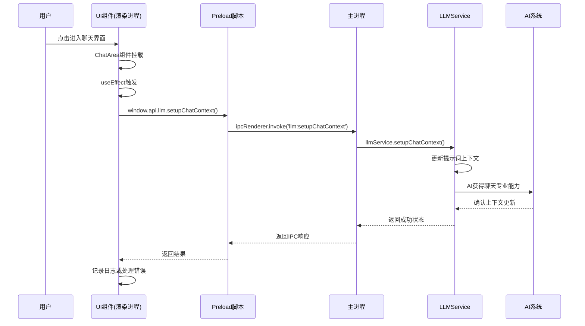

# DeeChat专属提示词系统架构文档

## 📋 概述

DeeChat专属提示词系统是一个五层架构的智能上下文管理系统，使AI能够根据用户当前使用的功能模块自动调整行为模式，从通用AI助手升级为专业的桌面应用AI伴侣。

## 🏗️ 五层架构详解

### 第1层：UI组件自动激活层 (UI Component Auto-Activation Layer)

#### 🎯 核心作用
**自动感知用户当前操作的功能模块，无需用户手动切换即可激活对应的AI专业能力。**

#### 💡 工作原理
每个UI组件在挂载(mount)时，通过React的`useEffect`钩子自动调用对应的上下文设置函数，告诉AI当前用户在使用什么功能。

#### 📝 具体实现示例

**聊天界面自动激活 (ChatArea.tsx)**
```typescript
// 当用户进入聊天界面时，自动设置聊天上下文
useEffect(() => {
  const setupChatContext = async () => {
    try {
      if (window.api?.llm?.setupChatContext) {
        await window.api.llm.setupChatContext()
        console.log('✅ 聊天上下文设置成功')
      }
    } catch (error) {
      console.error('❌ 聊天上下文设置失败:', error)
    }
  }
  setupChatContext()
}, []) // 空依赖数组，只在组件挂载时执行一次
```

**资源管理界面自动激活 (ResourcesPage.tsx)**
```typescript
// 当用户进入资源管理界面时，自动设置资源管理上下文
useEffect(() => {
  const setupResourcesContext = async () => {
    try {
      if (window.api?.llm?.setupResourcesContext) {
        await window.api.llm.setupResourcesContext()
        console.log('✅ 资源管理上下文设置成功')
      }
    } catch (error) {
      console.error('❌ 资源管理上下文设置失败:', error)
    }
  }
  setupResourcesContext()
}, [])
```

#### 🌟 设计优势

1. **无感知体验**：用户无需任何额外操作，AI自动获得对应能力
2. **即时响应**：页面加载完成，AI立即具备相应的专业知识
3. **容错机制**：设置失败不影响页面正常使用
4. **维护简单**：每个组件只需要添加几行代码即可集成

#### 🎭 AI能力变化示例

| 用户操作 | UI组件 | 激活的AI能力 |
|---------|--------|-------------|
| 点击"聊天"标签 | ChatArea | 对话优化、工具调用、上下文记忆 |
| 点击"资源管理" | ResourcesPage | PromptX角色指导、文件分析、工具选择 |
| 点击"设置" | SettingsPage | 配置指导、MCP服务器管理、优化建议 |
| 打开文件管理器 | FileManager | 文件操作安全、组织建议、格式转换 |

---

### 第2层：IPC通信层 (IPC Communication Layer)

#### 🎯 核心作用
**在Electron的渲染进程(前端)和主进程(后端)之间建立安全、高效的通信桥梁，传递上下文切换指令。**

#### 💡 为什么需要IPC？

Electron应用采用多进程架构：
- **渲染进程**：运行前端UI代码(React)，但出于安全考虑，无法直接访问系统资源
- **主进程**：运行后端逻辑，可以访问文件系统、网络、AI服务等

提示词系统的核心逻辑在主进程中，前端UI需要通过IPC与主进程通信来触发上下文切换。

#### 📝 IPC通信实现

**主进程注册处理器 (main/index.ts)**
```typescript
// 注册IPC处理器，监听来自渲染进程的调用
ipcMain.handle('llm:setupChatContext', async () => {
  try {
    await llmService.setupChatContext()
    console.log('🎯 [主进程] 聊天上下文设置完成')
    return { success: true }
  } catch (error) {
    console.error('❌ [主进程] 聊天上下文设置失败:', error)
    return { success: false, error: error.message }
  }
})

ipcMain.handle('llm:setupResourcesContext', async () => {
  try {
    await llmService.setupResourcesContext()
    console.log('🎯 [主进程] 资源管理上下文设置完成')
    return { success: true }
  } catch (error) {
    console.error('❌ [主进程] 资源管理上下文设置失败:', error)
    return { success: false, error: error.message }
  }
})

// 通用上下文设置
ipcMain.handle('llm:setFeatureContext', async (_, feature, data) => {
  try {
    await llmService.setFeatureContext(feature, data)
    console.log(`🎯 [主进程] 功能上下文设置为: ${feature}`)
    return { success: true }
  } catch (error) {
    console.error('❌ [主进程] 功能上下文设置失败:', error)
    return { success: false, error: error.message }
  }
})

// PromptX角色设置
ipcMain.handle('llm:setPromptXRole', async (_, role, description, capabilities) => {
  try {
    await llmService.setPromptXRole(role, description, capabilities)
    console.log(`🎭 [主进程] PromptX角色设置为: ${role}`)
    return { success: true }
  } catch (error) {
    console.error('❌ [主进程] PromptX角色设置失败:', error)
    return { success: false, error: error.message }
  }
})
```

**预加载脚本暴露API (preload/index.ts)**
```typescript
// 将主进程的功能安全地暴露给渲染进程
contextBridge.exposeInMainWorld('api', {
  llm: {
    // 聊天上下文设置
    setupChatContext: () => ipcRenderer.invoke('llm:setupChatContext'),
    
    // 资源管理上下文设置
    setupResourcesContext: () => ipcRenderer.invoke('llm:setupResourcesContext'),
    
    // 文件管理上下文设置
    setupFileManagerContext: () => ipcRenderer.invoke('llm:setupFileManagerContext'),
    
    // 通用功能上下文设置
    setFeatureContext: (feature, data) => 
      ipcRenderer.invoke('llm:setFeatureContext', feature, data),
    
    // PromptX角色设置
    setPromptXRole: (role, description, capabilities) => 
      ipcRenderer.invoke('llm:setPromptXRole', role, description, capabilities),
    
    // 获取当前系统提示词(调试用)
    getCurrentSystemPrompt: () => 
      ipcRenderer.invoke('llm:getCurrentSystemPrompt'),
    
    // 清理提示词上下文
    cleanupPromptContext: () => 
      ipcRenderer.invoke('llm:cleanupPromptContext')
  }
})
```

#### 🔄 完整通信流程



#### 🛡️ 安全机制

1. **上下文隔离**：渲染进程无法直接访问主进程资源
2. **类型安全**：TypeScript确保参数类型正确
3. **错误处理**：每个IPC调用都包含完整的错误处理
4. **权限控制**：只暴露必要的API给渲染进程

#### ⚡ 性能优化

1. **异步处理**：所有IPC调用都是异步的，不阻塞UI
2. **批量操作**：支持一次调用设置多个上下文参数
3. **缓存机制**：避免重复的上下文设置操作
4. **懒加载**：只在需要时进行上下文切换

---

## 🌟 两层协作的核心价值

### 🎯 用户体验提升

**传统方式**：
```
用户进入聊天界面 → 手动告诉AI"现在开始聊天" → AI切换到聊天模式
```

**DeeChat智能方式**：
```
用户进入聊天界面 → AI自动获得聊天专业能力 → 立即提供专业对话服务
```

### 📊 技术架构优势

| 方面 | 传统实现 | DeeChat智能实现 |
|-----|---------|-----------------|
| **用户操作** | 需要手动切换模式 | 完全自动化 |
| **响应速度** | 需要等待用户指令 | 页面加载即激活 |
| **错误概率** | 用户可能忘记切换 | 系统自动处理 |
| **维护成本** | 需要用户培训 | 零学习成本 |
| **扩展性** | 添加新功能需要用户学习 | 添加新组件即可 |

### 🔧 开发者友好性

**新增功能模块只需3步**：

1. **创建UI组件时添加激活逻辑**：
```typescript
useEffect(() => {
  const setupNewFeatureContext = async () => {
    if (window.api?.llm?.setFeatureContext) {
      await window.api.llm.setFeatureContext('new-feature')
    }
  }
  setupNewFeatureContext()
}, [])
```

2. **在主进程注册IPC处理器**：
```typescript
ipcMain.handle('llm:setupNewFeatureContext', async () => {
  await llmService.setFeatureContext('new-feature')
})
```

3. **在FeatureContextProvider中定义提示词**：
```typescript
private buildNewFeatureContextPrompt(): string {
  return `## New Feature Context
  Specialized guidance for the new feature...`
}
```

---

## 🎉 总结

UI组件激活层和IPC通信层共同构建了一个**智能、自动、安全**的上下文管理系统：

- **UI组件激活层**负责**感知用户意图**，在用户进入不同功能时自动触发相应的AI能力激活
- **IPC通信层**负责**安全传递指令**，确保前端的意图能够安全、高效地传达给后端的AI系统

这种设计让DeeChat实现了**真正的智能桌面AI伴侣体验**——AI不再是被动响应的工具，而是能够主动理解用户当前需求并提供专业化服务的智能助手。

这正是现代AI桌面应用架构的最佳实践，体现了**用户体验至上**和**技术服务于体验**的设计理念。