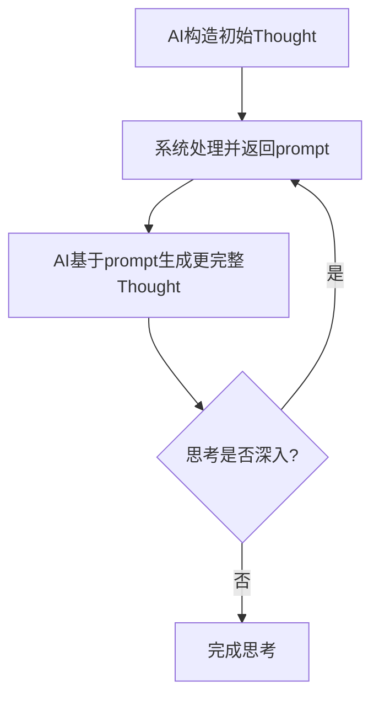
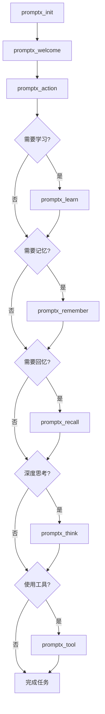
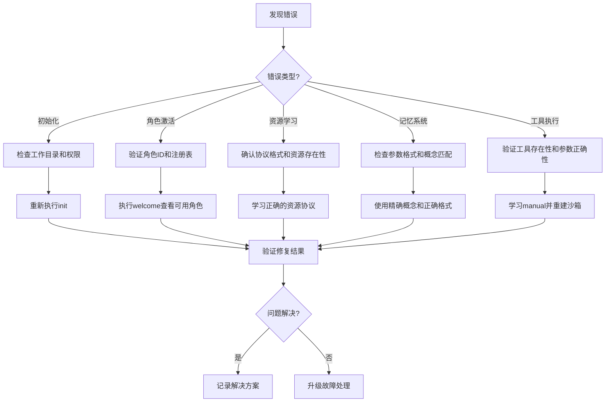

# PromptX MCP工具完整使用指南

> **文档版本**: v1.0.0  
> **更新时间**: 2025-08-03  
> **适用版本**: PromptX v0.1.1-dev.3+  

基于对PromptX源码的深入分析，本文档提供所有9个MCP工具的详细规格、调用方式和最佳实践。

---

## 📋 目录

- [核心工具概览](#核心工具概览)
- [详细工具规格说明](#详细工具规格说明)
- [工具调用模式与最佳实践](#工具调用模式与最佳实践)
- [错误处理与故障排除](#错误处理与故障排除)
- [高级使用技巧](#高级使用技巧)

---

## 🎯 核心工具概览

PromptX提供**9个MCP工具**，实现了完整的AI认知增强生态：

| 工具类别 | 工具名称 | 核心功能 | 使用频率 | 状态 |
|---------|----------|----------|----------|------|
| **🚀 系统管理** | `promptx_init` | 专业能力启动器 | 🔥 必需 | ✅ 稳定 |
| **🎭 角色发现** | `promptx_welcome` | 专业服务清单 | 🔥 高频 | ✅ 稳定 |
| **⚡ 角色激活** | `promptx_action` | 专业角色激活器 | 🔥 高频 | ✅ 稳定 |
| **🧠 资源学习** | `promptx_learn` | 专业资源学习器 | 📚 中频 | ✅ 稳定 |
| **🔍 记忆检索** | `promptx_recall` | 认知检索系统 | 🧠 中频 | ✅ 稳定 |
| **💾 记忆存储** | `promptx_remember` | 认知记忆系统 | 🧠 自动 | ✅ 稳定 |
| **🤔 深度思考** | `promptx_think` | 认知思考系统 | 🤔 高级 | ⚡ Beta |
| **🔧 工具执行** | `promptx_tool` | 工具执行器 | 🛠️ 开发 | ⚡ Beta |

---

## 📖 详细工具规格说明

### 1. 🎯 `promptx_init` - AI专业能力启动器

**功能定位**：PromptX系统的初始化工具，多项目支持的核心入口

**核心能力**：
- ✨ 瞬间获得任何领域的专家级思维和技能
- 🎭 一键激活丰富的专业角色库
- 💾 获得跨对话记忆能力
- 🏗️ 支持多个IDE/项目同时使用，项目间完全隔离

**调用时机**：
- ✅ **系统首次使用时** - 初始化PromptX环境
- ✅ **创建新角色后** - 刷新注册表发现新角色
- ✅ **角色激活出错时** - 重新发现和注册角色
- ✅ **查看当前版本号** - 获取系统状态信息
- ✅ **项目路径发生变化时** - 重新绑定项目环境

**参数规格**：
```json
{
  "workingDirectory": {
    "type": "string",
    "required": true,
    "description": "当前项目的工作目录绝对路径。AI应该知道当前工作的项目路径"
  },
  "ideType": {
    "type": "string", 
    "required": false,
    "description": "IDE或编辑器类型",
    "examples": ["cursor", "vscode", "claude", "windsurf", "cline"],
    "default": "unknown"
  }
}
```

**调用示例**：
```json
// 基础调用
{
  "workingDirectory": "/Users/username/Desktop/MyProject"
}

// 完整调用
{
  "workingDirectory": "/Users/username/Desktop/MyProject",
  "ideType": "cursor"
}
```

**CLI参数转换**：
```javascript
// 输入
{
  "workingDirectory": "/path/to/project", 
  "ideType": "cursor"
}

// 转换为CLI参数
[{
  "workingDirectory": "/path/to/project",
  "ideType": "cursor"
}]
```

**返回信息**：
- 🎯 PromptX版本信息
- 📊 发现的角色和工具统计
- 🏗️ 项目环境绑定状态
- ⚡ 系统就绪状态确认

---

### 2. 🎭 `promptx_welcome` - 专业服务清单

**功能定位**：展示所有可用的AI专业角色和工具的完整清单

**核心能力**：
- 📦 展示系统级资源（PromptX核心）
- 🏗️ 展示项目级资源（当前项目特有）
- 👤 展示用户级资源（用户自定义）
- 📊 提供资源统计和快速索引

**调用时机**：
- ✅ **初次进入项目** - 了解可用的角色和工具
- ✅ **选择专业角色** - 不知道有哪些角色可选时
- ✅ **寻找合适工具** - 完成特定任务需要工具支持
- ✅ **资源管理** - 了解项目级、系统级、用户级资源
- ✅ **定期检查** - 查看新增的角色和工具

**参数规格**：
```json
{} // 无参数，直接调用
```

**调用示例**：
```json
{} // 直接调用，无需任何参数
```

**输出内容结构**：
```
🎭 可激活的专业角色：
├── 📦 系统角色（PromptX内置）
│   ├── assistant - AI助手
│   ├── luban - 工具开发专家  
│   ├── nuwa - 角色创造专家
│   ├── noface - 万能学习助手
│   └── sean - 产品决策专家
├── 🏗️ 项目角色（项目特有）
└── 👤 用户角色（用户创建）

🔧 可调用的功能工具：
├── 核心工具：init, welcome, action
├── 学习工具：learn, recall, remember  
├── 思考工具：think
└── 执行工具：tool

📊 资源统计：
├── 总角色数：X个
├── 总工具数：Y个
└── 可用协议：12种
```

**CLI参数转换**：
```javascript
// 任何输入都转换为空数组
[] 
```

---

### 3. ⚡ `promptx_action` - 专业角色激活器

**功能定位**：瞬间获得指定专业角色的完整思维和技能包

**核心能力**：
- ⚡ 瞬间加载角色的完整定义（人格、原则、知识）
- 🔗 自动获取角色的所有依赖资源
- 🧠 激活角色特有的思维模式和执行技能
- 💾 加载角色相关的历史经验和记忆
- 🛠️ 提供角色专属的工作方法论
- 🔄 支持角色间的快速切换
- ⚡ 3秒内完成专业化转换

**系统内置角色**（必须精确匹配）：

| 角色ID | 角色名称 | 专业领域 | 核心能力 |
|--------|----------|----------|----------|
| `assistant` | AI助手 | 通用助手 | 基础对话和任务处理 |
| `luban` | 鲁班 | 工具开发 | PromptX工具开发大师 |
| `noface` | 无面 | 学习适应 | 万能学习助手，可转换为任何领域专家 |
| `nuwa` | 女娲 | 角色创造 | AI角色创造专家，2分钟创建专业助手 |
| `sean` | Sean | 产品决策 | deepractice.ai创始人，矛盾驱动决策 |

**角色职责边界**：
```
🎯 任务类型 → 推荐角色
├── 🔧 开发工具需求 → luban (鲁班)
├── 🎭 创建角色需求 → nuwa (女娲)
├── 📚 学习新领域需求 → noface (无面)  
├── 🎯 产品决策需求 → sean (Sean)
└── 💬 通用任务需求 → assistant (助手)
```

**参数规格**：
```json
{
  "role": {
    "type": "string",
    "required": true,
    "description": "要激活的角色ID",
    "examples": ["assistant", "luban", "nuwa", "noface", "sean"],
    "pattern": "^[a-zA-Z][a-zA-Z0-9-_]*$"
  }
}
```

**调用示例**：
```json
// ✅ 正确示例
{"role": "nuwa"}        // 激活女娲角色创造专家
{"role": "assistant"}   // 激活AI助手
{"role": "sean"}        // 激活Sean产品决策专家

// ❌ 错误示例 
{"role": "架构师"}      // 应先用welcome查看可用角色
{"role": "developer"}   // 不存在的系统角色
```

**重要提醒**：
- ⚠️ 系统角色是具名品牌角色，必须使用准确的角色ID激活
- ⚠️ 不允许基于相似性或关联性激活系统角色
- ✅ 如用户请求的角色不在系统列表，先用`promptx_welcome`查看所有可用角色
- ✅ 项目级和用户级角色可能使用通用名称（如"架构师"、"前端开发"等）

**CLI参数转换**：
```javascript
// 输入
{"role": "nuwa"}

// 转换为CLI参数
["nuwa"]
```

**使用前置条件**：
- ✅ 必须已通过`promptx_init`初始化项目环境
- ✅ 确保角色ID的正确性（使用welcome查看可用角色）
- ✅ 新创建的角色需要先刷新注册表

---

### 4. 🧠 `promptx_learn` - 专业资源学习器

**功能定位**：PromptX资源管理体系的统一学习入口

**核心能力**：
- 🔗 支持12种标准协议的资源加载和解析
- 🧠 智能识别资源类型并选择合适的加载策略
- 📄 保持manual文档的原始格式不进行语义渲染
- 🌐 支持跨项目资源访问和继承机制
- 🔄 自动处理资源间的依赖关系
- 📊 提供结构化的学习内容展示
- ⚡ 资源内容的实时加载和更新

**支持的12种资源协议**：

| 协议格式 | 资源类型 | 描述 | 示例 |
|---------|----------|------|------|
| `@role://角色ID` | 角色定义 | 完整角色定义文件 | `@role://assistant` |
| `@thought://资源ID` | 思维模式 | 专业思维模式和方法论 | `@thought://creativity` |
| `@execution://资源ID` | 执行技能 | 具体的执行技能和实践 | `@execution://best-practice` |
| `@knowledge://资源ID` | 专业知识 | 领域专业知识体系 | `@knowledge://scrum` |
| `@manual://工具名` | 使用手册 | 工具使用手册（必须真实存在） | `@manual://calculator` |
| `@tool://工具名` | 工具代码 | 工具源代码实现 | `@tool://calculator` |
| `@package://包名` | 工具包 | 完整的工具包资源 | `@package://utils` |
| `@project://路径` | 项目资源 | 项目特定的资源文件 | `@project://config.json` |
| `@file://路径` | 文件资源 | 直接的文件系统资源 | `@file:///path/to/file` |
| `@prompt://ID` | 提示词模板 | 标准化的提示词模板 | `@prompt://summary` |
| `@user://资源` | 用户资源 | 用户自定义创建的资源 | `@user://my-role` |
| `@resource://ID` | 通用资源 | 通用资源引用 | `@resource://config` |

**调用时机**：
- ✅ **工具使用前** - 学习@manual://工具名了解用法
- ✅ **获取专业知识** - 学习特定领域的思维模式和技能
- ✅ **角色深度了解** - 查看角色的完整定义和能力边界
- ✅ **项目资源学习** - 了解项目特定的配置和资源
- ✅ **复杂概念理解** - 学习相关基础知识后再处理复杂任务

**参数规格**：
```json
{
  "resource": {
    "type": "string",
    "required": true,
    "description": "资源URL，使用标准协议格式",
    "pattern": "^@[a-z]+://[^\\s]+$",
    "examples": [
      "@manual://calculator",
      "@thought://creativity", 
      "@knowledge://scrum",
      "@execution://best-practice"
    ]
  }
}
```

**调用示例**：
```json
// 学习工具使用手册
{"resource": "@manual://calculator"}

// 学习思维模式
{"resource": "@thought://creativity"}

// 学习专业知识
{"resource": "@knowledge://scrum"}

// 学习执行技能
{"resource": "@execution://best-practice"}

// 学习角色定义
{"resource": "@role://assistant"}

// 学习项目配置
{"resource": "@project://config.json"}
```

**CLI参数转换**：
```javascript
// 输入
{"resource": "@manual://calculator"}

// 转换为CLI参数
["@manual://calculator"]
```

**重要提醒**：
- ⚠️ 只能学习真实存在的资源，绝不虚构
- ⚠️ 资源不存在时会返回错误，不要猜测
- ⚠️ 工具manual必须先存在才能学习使用
- ✅ 工具使用必须遵循"先学习manual，再考虑使用tool"的原则

**使用前置条件**：
- ✅ 必须已通过`promptx_init`初始化项目环境
- ✅ 确保资源路径或ID的正确性
- ✅ 对于工具使用必须先学习manual再考虑使用tool

---

### 5. 🔍 `promptx_recall` - 认知检索系统

**功能定位**：基于检索心理学的记忆激活和提取机制

**核心原理**：

#### 🧠 语义鸿沟强制检索触发
**核心原则**：AI预训练知识(共识)与私有记忆(私识)间存在鸿沟时必须检索

**触发场景**：
- 🔸 **个人化概念** - 用户身份、偏好、项目背景、历史交互
- 🔸 **专业细节** - 特定配置、技术决策、解决方案、工作流程
- 🔸 **上下文特征** - 当前对话涉及的角色特定概念和关系

#### 🎯 检索线索严格匹配原则
**检索线索(Retrieval Cues)**：只能使用语义网络mindmap中已存在的精确概念

**匹配规则**：
- ❌ **禁止词汇组合** - 不得将"用户"+"体验"合成查询
- ✅ **精确概念匹配** - 如mindmap中有"用户体验"，直接使用完整概念
- 🔗 **激活扩散路径** - 通过Schema概念触发相关记忆的连锁激活

#### 🔗 多轮激活扩散检索
**记忆提取流程**：检索线索→记忆激活→概念扩散→关联检索→知识重构


#### 💪 记忆强度优先原则
**强度导向提取**：高强度记忆优先激活和应用

| 强度范围 | 记忆类型 | 处理策略 |
|---------|----------|----------|
| 0.9-1.0 | 核心记忆 | 立即激活应用 |
| 0.7-0.9 | 重要记忆 | 优先考虑 |
| 0.5-0.7 | 辅助记忆 | 补充使用 |
| 0.3-0.5 | 背景信息 | 弱激活 |

**参数规格**：
```json
{
  "role": {
    "type": "string", 
    "required": true,
    "description": "要检索记忆的角色ID",
    "examples": ["java-developer", "product-manager", "copywriter"]
  },
  "query": {
    "type": "string",
    "required": true, 
    "description": "检索线索，必须使用语义网络mindmap中的精确概念",
    "examples": ["用户体验", "项目架构", "技术方案"],
    "note": "禁止拆分或组合概念，如mindmap中有'用户体验'就直接使用，不要拆分为'用户'和'体验'"
  }
}
```

**调用示例**：
```json
// ✅ 正确示例：使用精确概念
{
  "role": "java-developer",
  "query": "用户体验"  // mindmap中的完整概念
}

{
  "role": "product-manager", 
  "query": "项目架构"  // 完整的概念名称
}

// ❌ 错误示例：拆分概念
{
  "role": "java-developer",
  "query": "用户"     // 不完整的概念片段
}
```

**高积极性检索要求**：
- ⚡ 发现任何个人化概念立即检索验证
- ⚡ 专业话题必须检索相关经验和偏好  
- ⚡ 概念冲突时强制recall确认私识含义
- ⚡ 每轮对话至少识别3个潜在语义鸿沟

**CLI参数转换**：
```javascript
// 输入
{
  "role": "java-developer",
  "query": "用户体验"
}

// 转换为CLI参数
["java-developer", "用户体验"]
```

**执行流程**：
```
语义鸿沟识别 → 概念精确匹配 → 记忆激活 → 激活扩散 → 知识应用
```

---

### 6. 💾 `promptx_remember` - 认知记忆系统

**功能定位**：基于认知心理学模拟人类记忆编码-存储-检索机制

**核心原理**：

#### 🔍 语义鸿沟触发机制
**触发条件**：AI预训练知识(共识)与私有信息(私识)间存在语义鸿沟

**触发场景**：
- 🔸 **个人化信息** - 身份、偏好、项目细节
- 🔸 **专业细节** - 技术栈、配置、历史决策
- 🔸 **上下文特征** - 对话中的特定概念关系

#### 🧠 记忆编码规则
**原子化原则**：基于词性分解为最小语义单位

| 编码类型 | 词性特征 | 用途 | 示例 |
|---------|----------|------|------|
| **ATOMIC** | 实体词性（名词、形容词、专有名词） | 独立概念 | "Sean", "PromptX", "创新" |
| **LINK** | 关系词性（动词、介词、关系词） | 概念连接 | "开发", "创建", "属于" |
| **PATTERN** | 复合结构（短语、流程、模式） | 复杂模式 | "敏捷开发流程", "用户研究方法" |

**Schema概念层级**：认知结构的三层架构
```
基本概念
  上位概念  
  下位概念
```

**记忆强度巩固**：0-1评估，影响检索权重
- **0.9-1.0** - 核心知识，频繁激活
- **0.7-0.9** - 重要知识，定期使用
- **0.5-0.7** - 有用知识，偶尔检索
- **0.3-0.5** - 背景信息，弱激活

**高积极性记忆要求**：
AI必须主动识别并记忆以下场景：

🚨 **强制记忆场景**：
- 🔴 **错误重复2次以上** → 立即记忆教训避免再犯
- 🟡 **获得新的项目特定知识** → 立即记忆便于后续使用
- 🟢 **发现更好的解决方案** → 记忆并替代旧方案
- 🔵 **用户明确指出问题** → 深刻记忆避免再犯
- 🟣 **完成复杂任务后** → 总结并记忆成功经验
- ⚪ **每轮对话** → 至少识别3个值得记忆的知识点

**参数规格**：
```json
{
  "role": {
    "type": "string",
    "required": true,
    "description": "要保存记忆的角色ID",
    "examples": ["java-developer", "product-manager", "copywriter"]
  },
  "engrams": {
    "type": "array",
    "required": true,
    "minItems": 1,
    "description": "Engram对象数组，支持批量记忆保存",
    "items": {
      "type": "object",
      "properties": {
        "content": {
          "type": "string",
          "required": true,
          "description": "要保存的重要信息或经验"
        },
        "schema": {
          "type": "string", 
          "required": true,
          "description": "知识关系图，用缩进文本格式表达知识在整个知识体系中的位置"
        },
        "strength": {
          "type": "number",
          "minimum": 0,
          "maximum": 1,
          "default": 0.8,
          "description": "记忆强度，表示知识的重要程度，影响后续检索优先级"
        },
        "type": {
          "type": "string",
          "enum": ["ATOMIC", "LINK", "PATTERN"],
          "default": "ATOMIC",
          "description": "Engram类型，基于词性选择"
        }
      }
    }
  }
}
```

**调用示例**：
```json
{
  "role": "java-developer",
  "engrams": [
    {
      "content": "Sean是PromptX框架的创始人",
      "schema": "Sean\n  人物角色\n  技术创始人",
      "strength": 0.9,
      "type": "ATOMIC"
    },
    {
      "content": "PromptX是AI认知增强平台",
      "schema": "PromptX\n  软件系统\n  AI工具平台", 
      "strength": 0.95,
      "type": "ATOMIC"
    },
    {
      "content": "Sean创建了PromptX框架",
      "schema": "创建关系\n  开发行为\n  技术实现",
      "strength": 0.9,
      "type": "LINK"
    }
  ]
}
```

**编码示例解析**：
```
原信息："Sean开发PromptX框架"

分解为多个原子Engram：
[
  {
    content: "Sean是开发者", 
    schema: "Sean\n  人物\n  创始人", 
    strength: 0.9, 
    type: "ATOMIC"
  },
  {
    content: "PromptX是AI框架", 
    schema: "PromptX\n  软件系统\n  认知增强", 
    strength: 0.9, 
    type: "ATOMIC"
  },
  {
    content: "Sean开发PromptX", 
    schema: "开发\n  创造行为\n  编程实现", 
    strength: 0.95, 
    type: "LINK"
  }
]
```

**关键约束**：
- ⚠️ **原子性** - 一个Engram = 一个核心概念
- ⚠️ **纯概念Schema** - 禁用"身份:"等标签，直接写概念
- ⚠️ **批量编码** - 复杂信息必须分解为多个原子Engram
- ⚠️ **自动执行** - 每轮对话后强制触发

**CLI参数转换**：
```javascript
// 输入
{
  "role": "java-developer",
  "engrams": [...]
}

// 转换为CLI参数
["java-developer", JSON.stringify(engrams)]
```

**执行流程**：
```
语义鸿沟识别 → 原子化分解 → Schema构建 → 强度评估 → 批量存储
```

---

### 7. 🤔 `promptx_think` - 认知思考系统

**功能定位**：基于认知心理学的思维链式推理机制

**核心理解**：
思考是一个**递归深化**的过程，每次调用都传入当前的Thought状态，系统返回指导生成下一个更深入Thought的prompt。

#### 🧠 Thought核心要素

**AI负责构造的创造性部分**：
1. **goalEngram** - 本轮思考的目标（必需）
2. **thinkingPattern** - 选择的思维模式（必需）  
3. **spreadActivationCues** - 激活的检索线索（必需）
4. **insightEngrams** - 从记忆中产生的洞察（可选）
5. **conclusionEngram** - 综合形成的结论（可选）
6. **confidence** - 对结论的置信度评估（可选）

**系统自动处理的部分**：
- **recalledEngrams** - 基于cues自动检索相关记忆
- **iteration** - 自动递增迭代次数
- **previousThought** - 自动保存前序思想
- **timestamp** - 自动记录时间戳
- **thinkingState** - 自动推断思考状态

#### 🎭 思维模式类型

| 思维模式 | 英文名 | 适用场景 | 特征 |
|---------|--------|----------|------|
| 推理思维 | `reasoning` | 逻辑分析、因果推理 | 严谨、系统化 |
| 创造思维 | `creative` | 创新设计、头脑风暴 | 发散、想象力 |
| 批判思维 | `critical` | 评估分析、质疑验证 | 客观、理性 |
| 系统思维 | `systematic` | 整体规划、架构设计 | 全局、结构化 |
| 叙述思维 | `narrative` | 故事构建、情境描述 | 连贯、生动 |
| 直觉思维 | `intuitive` | 快速判断、经验决策 | 敏锐、直接 |
| 分析思维 | `analytical` | 数据分析、拆解问题 | 细致、深入 |
| 经验思维 | `experiential` | 实践总结、案例分析 | 实用、具体 |

#### 🔄 认知循环流程



**参数规格**：
```json
{
  "role": {
    "type": "string",
    "required": true,
    "description": "进行思考的角色ID",
    "examples": ["scientist", "engineer", "writer"]
  },
  "thought": {
    "type": "object",
    "required": true,
    "description": "Thought对象，包含当前思考状态",
    "properties": {
      "goalEngram": {
        "type": "object",
        "required": true,
        "description": "本轮思考的目标",
        "properties": {
          "content": {"type": "string", "required": true},
          "schema": {"type": "string", "required": true}
        }
      },
      "thinkingPattern": {
        "type": "string",
        "required": true,
        "enum": ["reasoning", "creative", "critical", "systematic", "narrative", "intuitive", "analytical", "experiential"]
      },
      "spreadActivationCues": {
        "type": "array",
        "required": true,
        "minItems": 1,
        "items": {"type": "string"}
      },
      "insightEngrams": {
        "type": "array",
        "items": {
          "type": "object",
          "properties": {
            "content": {"type": "string", "required": true},
            "schema": {"type": "string"}
          }
        }
      },
      "conclusionEngram": {
        "type": "object", 
        "properties": {
          "content": {"type": "string", "required": true},
          "schema": {"type": "string"}
        }
      },
      "confidence": {
        "type": "number",
        "minimum": 0,
        "maximum": 1
      }
    }
  }
}
```

**调用示例**：

**第一次思考（初始）**：
```json
{
  "role": "scientist",
  "thought": {
    "goalEngram": {
      "content": "推理天空呈现蓝色的光学原理",
      "schema": "自然现象\n  光学现象\n    大气散射"
    },
    "thinkingPattern": "reasoning",
    "spreadActivationCues": ["光学", "大气", "散射", "颜色"]
  }
}
```

**后续思考（深化）**：
```json
{
  "role": "scientist", 
  "thought": {
    "goalEngram": {
      "content": "深入分析瑞利散射机制",
      "schema": "物理学\n  光学\n    散射理论"
    },
    "thinkingPattern": "reasoning",
    "spreadActivationCues": ["瑞利散射", "波长", "分子", "蓝光"],
    "insightEngrams": [
      {
        "content": "蓝光波长短，被大气分子散射更多",
        "schema": "光学原理\n  波长与散射\n    反比关系"
      }
    ],
    "conclusionEngram": {
      "content": "天空呈蓝色是因为瑞利散射效应",
      "schema": "科学结论\n  大气光学\n    颜色成因"
    },
    "confidence": 0.95
  }
}
```

**关键约束**：
- ⚠️ 每次都传入完整的Thought对象
- ⚠️ 首次思考必需三个字段：goalEngram、thinkingPattern、spreadActivationCues
- ⚠️ 其他要素根据思考深度逐步添加
- ⚠️ 系统会自动管理状态和检索记忆

**CLI参数转换**：
```javascript
// 输入
{
  "role": "scientist",
  "thought": {...}
}

// 转换为CLI参数
["scientist", JSON.stringify(thought)]
```

---

### 8. 🔧 `promptx_tool` - 工具执行器

**功能定位**：执行通过@tool协议声明的JavaScript功能工具

**核心能力**：
- 🔄 动态加载和执行JavaScript工具模块
- 📦 自动处理工具依赖的npm包安装
- 🏖️ 提供隔离的执行沙箱环境
- ⏱️ 支持异步工具执行和超时控制
- 🛡️ 完整的错误捕获和友好提示
- 📊 工具执行状态的实时监控
- ✅ 参数验证和类型检查

**执行流程规范**：
```
1. 识别需求 → 2. learn manual → 3. 理解功能 → 4. 准备参数 → 5. 执行工具
```

**调用时机**：
- ✅ **已学习manual** - 通过promptx_learn学习了@manual://工具名
- ✅ **明确需求** - 用户明确要求使用某个工具解决具体问题
- ✅ **任务匹配** - 当前任务正好匹配工具的设计用途
- ✅ **参数准备** - 所有必需参数都已准备就绪
- ✅ **最佳选择** - 确认这是解决问题的最佳工具选择

**参数规格**：
```json
{
  "tool_resource": {
    "type": "string",
    "required": true,
    "pattern": "^@tool://.+",
    "description": "工具资源引用，格式：@tool://tool-name",
    "examples": ["@tool://calculator", "@tool://file-processor"]
  },
  "parameters": {
    "type": "object", 
    "required": true,
    "description": "传递给工具的参数对象"
  },
  "rebuild": {
    "type": "boolean",
    "default": false,
    "description": "是否强制重建沙箱，用于处理异常情况"
  },
  "timeout": {
    "type": "number",
    "default": 30000,
    "description": "工具执行超时时间（毫秒）"
  }
}
```

**调用示例**：
```json
// 基础工具调用
{
  "tool_resource": "@tool://calculator",
  "parameters": {
    "operation": "add",
    "a": 5,
    "b": 3
  }
}

// 带超时的调用
{
  "tool_resource": "@tool://data-processor", 
  "parameters": {
    "inputFile": "data.csv",
    "outputFormat": "json"
  },
  "timeout": 60000
}

// 强制重建沙箱
{
  "tool_resource": "@tool://complex-tool",
  "parameters": {"config": "production"},
  "rebuild": true,
  "timeout": 45000
}
```

**严格禁止**：
- ❌ 未学习manual就直接调用工具
- ❌ 基于猜测使用工具
- ❌ 将工具用于非设计用途
- ❌ 忽略工具的使用限制和边界

**使用前置条件**：
- ✅ 必须先使用`promptx_learn`学习`@manual://工具名`
- ✅ 完全理解工具的功能、参数和返回值格式
- ✅ 确认工具适用于当前的使用场景
- ✅ 准备好所有必需的参数值

**CLI参数转换**：
```javascript
// 输入
{
  "tool_resource": "@tool://calculator",
  "parameters": {"a": 5, "b": 3},
  "rebuild": true,
  "timeout": 5000
}

// 转换为CLI参数
["@tool://calculator", {"a": 5, "b": 3}, "--rebuild", "--timeout", 5000]
```

**错误处理策略**：
- 🔍 **工具不存在** - 检查tool_resource格式和工具名称
- 📝 **参数错误** - 参考manual中的参数说明
- ⏱️ **执行超时** - 增加timeout值或优化参数
- 💥 **沙箱错误** - 使用rebuild参数重建环境

---

## 🎯 工具调用模式与最佳实践

### 📋 标准工作流程



### 🎭 角色激活优先级策略

```
📋 任务类型匹配原则：

🔧 技术开发任务：
├── 工具开发 → luban (鲁班)
├── 架构设计 → luban (鲁班)  
└── 代码实现 → luban (鲁班)

🎭 内容创作任务：
├── 角色创建 → nuwa (女娲)
├── 文案撰写 → assistant (助手)
└── 创意设计 → noface (无面)

📚 学习认知任务：
├── 新领域学习 → noface (无面)
├── 知识整理 → assistant (助手)
└── 技能提升 → noface (无面)

🎯 决策管理任务：
├── 产品决策 → sean (Sean)
├── 技术选型 → sean (Sean)
└── 战略规划 → sean (Sean)

💬 通用服务任务：
└── 日常对话 → assistant (助手)
```

### 🧠 记忆系统使用策略

#### 🚨 高积极性记忆触发场景

**错误避免类**：
```
场景：重复错误模式
触发：错误重复2次以上
行动：立即remember教训
强度：0.9+ （高强度）
类型：PATTERN （复合模式）

示例：
- 目录切换错误
- 命令使用错误  
- 配置参数错误
```

**知识积累类**：
```
场景：获得新知识
触发：学习到项目特定信息
行动：立即remember知识点
强度：0.7-0.9 （重要）
类型：ATOMIC （概念实体）

示例：
- 技术方案
- 配置信息
- 最佳实践
```

**经验总结类**：
```
场景：完成复杂任务
触发：任务成功完成
行动：remember成功经验
强度：0.8-0.9 （重要）
类型：PATTERN （流程模式）

示例：
- 解决方案
- 工作流程
- 调试技巧
```

#### 🔍 记忆检索最佳实践

**精确概念匹配**：
```
✅ 正确使用方式：
- query: "用户体验"    // mindmap中的完整概念
- query: "技术架构"    // 完整的专业术语
- query: "项目配置"    // 标准化概念

❌ 错误使用方式：
- query: "用户"       // 概念片段
- query: "体验设计"   // 组合概念（如果mindmap中没有）
- query: "技术+架构"  // 人工组合
```

**语义鸿沟识别**：
```
🎯 需要recall的典型场景：
- 用户特定的偏好设置
- 项目历史的技术决策  
- 之前讨论的解决方案
- 角色特定的工作模式
- 个人化的配置信息
```

### 🔧 工具执行安全原则

#### 🚀 标准执行流程

```
📋 严格执行步骤：

1️⃣ 需求确认
   ├── 明确工具用途
   ├── 确认适用场景
   └── 评估必要性

2️⃣ 学习准备  
   ├── promptx_learn @manual://工具名
   ├── 理解功能和限制
   └── 掌握参数规格

3️⃣ 参数准备
   ├── 收集必需参数
   ├── 验证参数格式
   └── 设置可选配置

4️⃣ 安全执行
   ├── promptx_tool调用
   ├── 监控执行状态
   └── 处理返回结果

5️⃣ 结果处理
   ├── 验证执行结果
   ├── 错误诊断处理
   └── 经验记忆存储
```

#### 🛡️ 安全检查清单

```
⚠️ 执行前检查：
□ 已学习工具manual
□ 理解工具功能边界
□ 准备完整参数
□ 确认安全性
□ 设置合理超时

⚠️ 执行中监控：  
□ 观察执行状态
□ 检查错误信息
□ 监控性能指标
□ 准备应急方案

⚠️ 执行后验证：
□ 验证结果正确性
□ 检查副作用
□ 记录使用经验
□ 优化参数设置
```

### 🤔 深度思考模式应用

#### 🎭 思维模式选择指南

```
🧠 思维模式适用场景：

reasoning (推理思维)：
├── 逻辑分析问题
├── 因果关系推导
├── 算法实现设计
└── 科学问题解决

creative (创造思维)：
├── 产品创新设计
├── 解决方案头脑风暴
├── 创意内容生成
└── 突破性思考

critical (批判思维)：
├── 方案评估分析
├── 风险识别评估
├── 质量审查验证
└── 决策权衡分析

systematic (系统思维)：
├── 架构设计规划
├── 整体方案制定
├── 流程优化设计
└── 全局策略规划
```

#### 🔄 递归思考深化策略

```
💭 思考深化路径：

浅层思考（iteration 1-2）：
├── 明确目标goalEngram
├── 选择思维模式thinkingPattern
├── 设定检索线索spreadActivationCues
└── 获取基础信息

中层思考（iteration 3-5）：
├── 产生初步洞察insightEngrams
├── 扩展检索范围
├── 综合分析信息
└── 形成初步结论

深层思考（iteration 6+）：
├── 深度洞察integration  
├── 结论confidence评估
├── 知识体系整合
└── 最终方案形成
```

---

## 🚨 错误处理与故障排除

### 📊 常见错误分类与解决方案

#### 1. 🔧 初始化错误

**错误类型**：`promptx_init`调用失败

| 错误症状 | 可能原因 | 解决方案 |
|---------|----------|----------|
| 工作目录无效 | 路径不存在或权限问题 | 检查路径有效性，确保访问权限 |
| 参数格式错误 | workingDirectory参数缺失 | 提供正确的绝对路径参数 |
| 重复初始化 | 多次调用init | 正常现象，系统会自动处理 |

**解决步骤**：
```json
// 1. 检查参数格式
{
  "workingDirectory": "/absolute/path/to/project"  // 必须是绝对路径
}

// 2. 验证路径存在
// 使用系统工具确认路径可访问

// 3. 重试初始化
// 如果仍失败，检查PromptX版本兼容性
```

#### 2. 🎭 角色激活错误

**错误类型**：`promptx_action`角色不存在

| 错误症状 | 可能原因 | 解决方案 |
|---------|----------|----------|
| 角色ID不存在 | 拼写错误或角色未注册 | 先执行`promptx_welcome`查看可用角色 |
| 系统角色识别失败 | 使用了相似但不准确的ID | 使用精确的系统角色ID |
| 自定义角色失效 | 角色创建后未刷新注册表 | 执行`promptx_init`刷新注册表 |

**解决步骤**：
```bash
# 1. 查看可用角色
promptx_welcome

# 2. 确认角色ID拼写
系统角色：assistant, luban, nuwa, noface, sean

# 3. 刷新注册表（如果是新创建的角色）
promptx_init
```

#### 3. 🧠 学习资源错误

**错误类型**：`promptx_learn`资源不存在

| 错误症状 | 可能原因 | 解决方案 |
|---------|----------|----------|
| 协议格式错误 | @符号或协议名错误 | 检查协议格式：@protocol://resource |
| 资源不存在 | 资源ID错误或资源未创建 | 验证资源是否真实存在 |
| 权限不足 | 无法访问指定资源 | 检查文件权限和路径访问性 |

**解决步骤**：
```bash
# 1. 验证协议格式
@manual://tool-name     # ✅ 正确
manual://tool-name      # ❌ 缺少@符号

# 2. 确认资源存在
promptx_welcome         # 查看可用资源

# 3. 检查资源类型
@manual://              # 工具使用手册
@knowledge://           # 专业知识
@thought://             # 思维模式
```

#### 4. 💾 记忆系统错误

**错误类型**：`promptx_remember`/`promptx_recall`失败

| 错误症状 | 可能原因 | 解决方案 |
|---------|----------|----------|
| 参数验证失败 | engrams格式错误 | 检查engrams数组格式和必需字段 |
| Schema格式错误 | 缩进格式不正确 | 使用标准缩进格式表达层级关系 |
| 检索概念不匹配 | query不是精确概念 | 使用mindmap中存在的精确概念 |

**解决步骤**：
```json
// 1. 检查engrams格式
{
  "engrams": [
    {
      "content": "string",     // ✅ 必需
      "schema": "string",      // ✅ 必需  
      "strength": 0.8,         // ✅ 0-1之间
      "type": "ATOMIC"         // ✅ 有效枚举值
    }
  ]
}

// 2. 验证Schema格式
"概念名称\n  上位概念\n    下位概念"  // ✅ 正确缩进

// 3. 确认recall查询概念
// 使用mindmap中存在的完整概念，不要拆分
```

#### 5. 🔧 工具执行错误

**错误类型**：`promptx_tool`执行失败

| 错误症状 | 可能原因 | 解决方案 |
|---------|----------|----------|
| 工具不存在 | tool_resource路径错误 | 检查@tool://格式和工具名称 |
| 参数错误 | parameters对象格式错误 | 参考manual中的参数说明 |
| 执行超时 | 工具执行时间过长 | 增加timeout值或优化参数 |
| 沙箱错误 | 环境依赖问题 | 使用rebuild参数重建环境 |

**解决步骤**：
```bash
# 1. 学习工具manual
promptx_learn @manual://tool-name

# 2. 检查工具资源格式  
@tool://tool-name       # ✅ 正确格式

# 3. 验证参数对象
# 参考manual中的参数示例

# 4. 处理执行问题
{
  "rebuild": true,        # 重建沙箱
  "timeout": 60000       # 增加超时时间
}
```

### 🔍 故障诊断流程

#### 📋 系统性故障排除步骤



#### 🚨 紧急故障处理

**系统完全无响应**：
```bash
# 1. 重新初始化整个系统
promptx_init

# 2. 检查基础功能
promptx_welcome

# 3. 测试核心角色
promptx_action assistant

# 4. 验证系统状态
# 如果仍有问题，检查PromptX版本和环境
```

**部分功能失效**：
```bash
# 1. 定位失效功能范围
# 测试每个工具的基础功能

# 2. 重建相关组件
# 对于工具执行问题使用rebuild参数

# 3. 清理缓存数据
# 必要时清理本地缓存和临时文件

# 4. 渐进式恢复
# 逐步恢复各项功能
```

---

## 🚀 高级使用技巧

### 💡 工具组合使用模式

#### 🎭 角色驱动工作流

**模式1：专家咨询模式**
```bash
# 1. 激活领域专家
promptx_action sean          # 产品决策专家

# 2. 回忆相关经验  
promptx_recall sean "产品决策"

# 3. 深度思考分析
promptx_think sean {...}

# 4. 记忆决策过程
promptx_remember sean {...}
```

**模式2：学习成长模式**
```bash
# 1. 激活学习角色
promptx_action noface        # 万能学习助手

# 2. 学习目标知识
promptx_learn @knowledge://scrum

# 3. 记忆关键概念  
promptx_remember noface {...}

# 4. 验证学习效果
promptx_recall noface "敏捷开发"
```

**模式3：创造创新模式**
```bash
# 1. 激活创造角色
promptx_action nuwa          # 角色创造专家

# 2. 学习创造方法
promptx_learn @execution://role-creation

# 3. 深度创造思考
promptx_think nuwa {...}

# 4. 执行创造工具
promptx_tool @tool://role-generator {...}
```

#### 🧠 认知增强组合

**记忆强化模式**：
```javascript
// 学习 → 记忆 → 检索 → 应用
const cognitivePattern = [
  "promptx_learn",      // 获取新知识
  "promptx_remember",   // 编码存储
  "promptx_recall",     // 激活检索  
  "promptx_think"       // 深度应用
];
```

**思维深化模式**：
```javascript
// 浅思考 → 深思考 → 洞察 → 结论
const thinkingPattern = [
  "promptx_think",      // 初始思考
  "promptx_recall",     // 补充记忆
  "promptx_think",      // 深化思考
  "promptx_remember"    // 固化洞察
];
```

### 🎯 性能优化技巧

#### ⚡ 调用频率优化

**高频工具**（每次会话）：
- `promptx_init` - 会话开始时调用一次
- `promptx_welcome` - 需要查看资源时
- `promptx_action` - 角色切换时

**中频工具**（根据需要）：
- `promptx_learn` - 学习新知识时
- `promptx_recall` - 需要回忆时  
- `promptx_remember` - 每轮对话后

**低频工具**（特殊场景）：
- `promptx_think` - 复杂分析时
- `promptx_tool` - 执行工具时

#### 🔄 缓存策略建议

**角色缓存**：
```bash
# 避免重复激活同一角色
# 一次激活后在会话中保持状态

# ❌ 低效方式
promptx_action assistant
# ... 一些对话 ...  
promptx_action assistant    # 重复激活

# ✅ 高效方式
promptx_action assistant
# ... 整个会话期间保持角色状态 ...
```

**学习缓存**：
```bash
# 避免重复学习相同资源
# 一次学习后记住关键内容

# ❌ 低效方式
promptx_learn @manual://tool
promptx_learn @manual://tool    # 重复学习

# ✅ 高效方式  
promptx_learn @manual://tool
promptx_remember {...}          # 记住关键信息
```

### 🛠️ 自定义扩展技巧

#### 📝 创建项目级资源

**1. 项目特定角色**：
```bash
# 在项目中创建自定义角色
# 路径：.promptx/resource/domain/custom-role/

# 激活方式
promptx_action custom-role-name
```

**2. 项目特定知识**：
```bash
# 创建项目知识库
# 路径：.promptx/resource/domain/role/knowledge/

# 学习方式
promptx_learn @knowledge://project-specific
```

**3. 项目特定工具**：
```bash
# 开发项目工具
# 路径：.promptx/tools/

# 使用方式  
promptx_learn @manual://project-tool
promptx_tool @tool://project-tool {...}
```

#### 🎭 角色定制策略

**渐进式角色完善**：
```bash
# 1. 基础角色创建
promptx_action nuwa          # 使用女娲创建角色

# 2. 角色能力测试
promptx_action new-role      # 测试新角色

# 3. 角色能力补强
promptx_learn @execution://new-skill    # 学习新技能
promptx_remember new-role {...}         # 记忆到角色

# 4. 角色迭代优化
# 根据使用反馈持续改进角色定义
```

**角色组合使用**：
```bash
# 多角色协作模式
promptx_action analyst       # 分析师角色
# ... 分析任务 ...

promptx_action designer      # 设计师角色  
# ... 设计任务 ...

promptx_action developer     # 开发者角色
# ... 开发任务 ...
```

---

## 📊 总结与建议

### ✅ 核心要点回顾

1. **🚀 系统初始化** - 每个新环境必须先执行`promptx_init`
2. **🎭 角色驱动** - 通过角色激活获得专业能力
3. **🧠 学习优先** - 使用工具前必须先学习manual
4. **💾 记忆主动** - 积极记忆重要信息和经验
5. **🔍 精确检索** - 使用mindmap中的精确概念进行recall
6. **🤔 深度思考** - 复杂问题使用think进行递归思考
7. **🔧 安全执行** - 工具执行严格遵循安全流程

### 🎯 最佳实践建议

**新用户入门路径**：
```
promptx_init → promptx_welcome → promptx_action assistant
```

**日常使用模式**：
```
promptx_action [role] → promptx_recall [concepts] → [工作任务] → promptx_remember [insights]
```

**复杂任务处理**：
```
promptx_learn [resources] → promptx_think [analysis] → promptx_tool [execution] → promptx_remember [results]
```

### 🔮 进阶发展方向

1. **🎭 成为角色专家** - 掌握不同角色的特色和适用场景
2. **🧠 记忆架构师** - 构建个人化的知识记忆体系
3. **🔧 工具开发者** - 学习luban角色，开发自定义工具
4. **🤔 思维大师** - 熟练运用不同思维模式解决复杂问题
5. **🌐 生态建设者** - 为社区贡献角色、工具和知识资源

---

**🎉 恭喜！你已经掌握了PromptX MCP工具体系的完整使用方法。**

*现在开始你的AI认知增强之旅吧！* 🚀

---

> **文档维护**: 本文档基于PromptX源码分析生成，随项目更新而维护  
> **反馈渠道**: 如发现文档问题，请在项目Issues中反馈  
> **版本说明**: 适用于PromptX v0.1.1-dev.3及以上版本