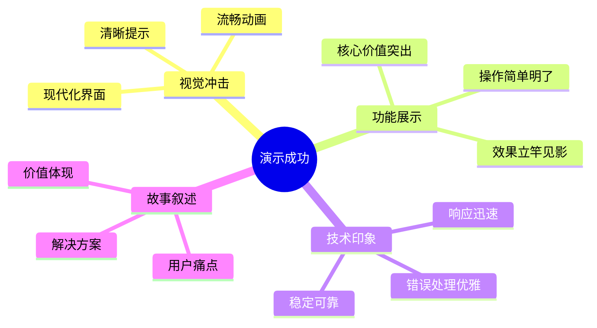

# 4x系列任务总览 - 演示优化层

## 系列目标
对ProjectS应用进行最终的演示优化，确保产品展示的完美效果，实现令人印象深刻的MVP演示。

## 时间分配
**总计: 5分钟 (55-60分钟)**
- 快速并行策略：2-3个任务可同时进行
- 每个任务预计1-2分钟完成

## 任务列表

### 40 - 界面美化和体验优化 (1-2分钟)
**核心职责**: 提升演示视觉效果和用户体验
- 优化界面视觉设计和动画效果
- 增强用户交互反馈和状态提示
- 调整演示环境下的最佳显示效果
- 确保界面在演示设备上的完美呈现

### 41 - 演示流程优化和彩排 (2-3分钟)  
**核心职责**: 完善演示脚本和流程控制
- 优化演示操作的流畅度和节奏
- 准备演示解说词和关键点提示
- 进行完整的演示彩排和时间控制
- 调优演示数据和示例选择

### 42 - 最终检查和发布准备 (1-2分钟)
**核心职责**: 确保产品发布就绪
- 进行最终的功能完整性检查
- 清理开发代码和调试信息
- 优化启动性能和资源使用
- 确认演示版本的稳定性

## 高效并行执行策略

### 🚀 快速并行设计
4x任务设计为**快速收尾**模式，因为：

1. **最后冲刺阶段**：时间紧迫，专注演示效果优化
2. **轻量级任务**：主要是调优和美化，不涉及功能开发
3. **并行友好**：界面美化、流程优化、最终检查可同时进行
4. **快速见效**：每个调优都能立即看到演示效果提升

### 💡 三人团队并行方案
```
开发者A: 任务40 (界面美化) - 专注视觉效果和用户体验
开发者B: 任务41 (演示优化) - 专注演示脚本和流程
开发者C: 任务42 (最终检查) - 专注稳定性和性能
```

### 🔗 两人团队并行方案
```
电脑A角色: 任务40 + 任务41 (界面优化+演示准备)
电脑B角色: 任务42 (最终检查和发布准备)
```

### 🎯 单人团队方案
```
推荐顺序: 任务40 → 任务41 → 任务42
优先级: 界面效果 → 演示流程 → 最终检查
```

## 演示优化理念

### 视觉第一印象
```javascript
// 演示优化重点
const demoOptimization = {
  visual: {
    priority: "high",
    elements: ["配色方案", "动画效果", "字体大小", "布局美观"],
    goal: "3秒内抓住观众注意力"
  },
  interaction: {
    priority: "high", 
    elements: ["按钮反馈", "状态提示", "进度显示", "错误友好"],
    goal: "每个操作都有清晰反馈"
  },
  performance: {
    priority: "medium",
    elements: ["启动速度", "响应时间", "动画流畅", "资源占用"],
    goal: "演示过程零卡顿"
  }
};
```

### 演示成功要素


## 快速优化框架

### 界面美化清单
```javascript
const uiOptimizations = [
  { item: "配色方案", time: "30s", impact: "high" },
  { item: "按钮样式", time: "20s", impact: "medium" },
  { item: "动画效果", time: "40s", impact: "high" },
  { item: "字体优化", time: "15s", impact: "medium" },
  { item: "布局调整", time: "25s", impact: "medium" }
];
```

### 演示脚本模板
```javascript
const demoScript = {
  opening: {
    duration: "10秒",
    content: "问题引入 + 产品介绍",
    keyPoints: ["用户痛点", "解决思路"]
  },
  coreDemo: {
    duration: "40秒", 
    content: "核心功能演示",
    keyPoints: ["语音输入", "AI优化", "一键复制"]
  },
  closing: {
    duration: "10秒",
    content: "价值总结 + 未来展望", 
    keyPoints: ["核心价值", "技术亮点"]
  }
};
```

## 演示效果验证

### 关键指标检查
```javascript
const demoKPIs = {
  visualAppeal: {
    metric: "界面美观度",
    target: "现代化、专业感",
    validation: "截图对比、团队评分"
  },
  userExperience: {
    metric: "操作流畅度", 
    target: "零卡顿、反馈及时",
    validation: "实际操作测试"
  },
  technicalStability: {
    metric: "演示稳定性",
    target: "零错误、快速响应",
    validation: "多次彩排验证"
  },
  storyImpact: {
    metric: "演示说服力",
    target: "逻辑清晰、价值突出",
    validation: "观众反馈模拟"
  }
};
```

## 与前序任务的协同

### 优化依赖关系
```
4x演示优化层
├── 基于 3x集成测试层
│   ├── 功能稳定性确认 (30)
│   ├── 异常处理验证 (31)  
│   └── 演示环境就绪 (32)
├── 优化 2x业务流程层
│   ├── 工作流体验优化 (20)
│   ├── 错误提示美化 (21)
│   └── 性能表现提升 (22)
└── 美化 1x+0x 界面层
    ├── UI组件视觉优化
    ├── 交互动画增强
    └── 整体风格统一
```

### 快速优化策略
```
发现问题 → 2分钟快速修复 → 立即验证效果 → 下一个优化点
```

## 成功标准

- **基础达标**：界面美观现代，演示流程顺畅，系统稳定可靠
- **预期品质**：视觉效果令人印象深刻，演示故事逻辑清晰，技术实现出色
- **卓越表现**：完美的产品演示，强烈的技术震撼，明确的商业价值

## MVP演示最终目标

4x系列的终极目标是确保：
- **技术实力展示**：代码质量、架构设计、实现效果
- **产品价值体现**：用户痛点、解决方案、使用价值  
- **团队能力证明**：快速开发、协作效率、创新思维
- **商业前景展望**：市场需求、技术优势、发展潜力

通过4x系列的精心优化，确保这个60分钟的MVP不仅能完整运行，更能给观众留下深刻印象，完美展现团队的技术实力和产品愿景！ 